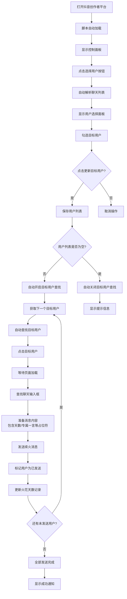

# ScriptCat-Douyin-Fire-Helper 🔥

抖音续火花自动发送助手 - 每天自动发送续火消息，保持好友火花不熄灭！支持多目标用户批量发送，学生党狂喜！

[](https://github.com/dr-190/ScriptCat-Douyin-Fire-Helper/blob/main/LICENSE)
[](https://www.tampermonkey.net/)
[](https://docs.scriptcat.org/)
[](https://github.com/dr-190/ScriptCat-Douyin-Fire-Helper/stargazers)
[](https://github.com/dr-190/ScriptCat-Douyin-Fire-Helper/issues)
[](https://github.com/dr-190/ScriptCat-Douyin-Fire-Helper/releases)

## ✨ 功能特性

### 🔥 火花天数记录（新！）
- **天数占位符**: 新增 `[天数]` 占位符，自动计算火花持续天数
- **智能日期检查**: 每天第一次发送时自动增加天数
- **手动修改天数**: 支持在设置面板中手动调整当前天数
- **控制面板显示**: 在控制面板实时显示当前火花天数

### 💫 专属一言功能（新！）
- **星期专属文案**: 支持周一到周日分别设置不同的文案
- **专属占位符**: 新增 `[专属一言]` 占位符，自动匹配当天文案
- **发送模式选择**: 支持随机或顺序发送专属一言
- **防重复机制**: 每天独立记录发送历史，避免重复发送相同文案

### 🎲 随机发送时间（新！）
- **随机时间模式**: 新增随机时间模式开关
- **时间范围设置**: 设置开始时间和结束时间范围
- **智能随机**: 每天在范围内随机选择发送时间
- **跨天支持**: 支持跨天时间范围设置

### 👥 用户列表解析（新！）
- **自动解析用户**: 新增"选择用户"按钮，自动解析当前聊天列表中的用户
- **可视化选择**: 支持全选/取消全选，一键添加到目标用户列表
- **智能去重**: 自动避免用户名重复添加
- **状态标识**: 已添加的用户默认打勾，清晰显示选择状态

### 👥 多目标用户批量发送
- **批量用户管理**: 支持多个目标用户，用换行符分隔
- **智能开关**: 目标用户查找功能根据用户列表自动开启/关闭
- **发送进度跟踪**: 实时显示发送进度（已发送/总用户数）
- **连续自动发送**: 发送完一个用户后自动切换到下一个
- **重试策略配置**: 可选择重试时使用同一用户或切换用户
- **每日重置记录**: 自动重置每日发送记录，避免重复发送

### 🎨 抖音风格界面设计
- **现代化UI**: 采用抖音风格的深色主题设计，视觉体验更佳
- **功能分类设置**: 设置面板按功能模块分类，查找配置更便捷
- **可拖动面板**: 支持拖拽移动控制面板，自由调整位置
- **重新打开按钮**: 关闭面板后可快速重新打开，操作更流畅

### 🎯 智能目标用户查找
- **自动查找点击**: 配置目标用户名，自动在聊天列表中查找并点击
- **实时状态监控**: 显示用户查找状态（寻找中/已找到/未找到）
- **智能防抖节流**: 优化查找频率，避免页面卡顿
- **多层点击策略**: 支持直接点击和事件触发两种方式

### 🕒 智能定时发送
- **精准定时**: 支持自定义发送时间（默认 00:01:00）
- **随机时间**: 支持在指定时间范围内随机选择发送时间
- **自动重试**: 可配置重试机制，最多重试10次
- **每日检测**: 智能判断当日是否已发送，避免重复
- **实时倒计时**: 显示下次发送的精确倒计时

### 🎭 丰富消息内容
- **一言API集成**: 自动获取优美句子，支持自定义格式
- **TXTAPI支持**: 支持外部API和手动文本两种模式
- **灵活格式**: 自定义消息模板，支持所有占位符替换
- **随机选择**: 手动模式下支持随机或顺序发送文本

### 📊 增强日志系统
- **完整历史记录**: 记录所有操作日志，支持查看和导出
- **智能日志管理**: 自动限制日志数量（默认200条），避免内存占用
- **实时状态显示**: 显示API状态、重试次数等关键信息
- **一键清空**: 支持快速清空所有日志记录

### 🎛️ 人性化控制
- **可视化面板**: 实时显示状态、倒计时、火花天数和操作日志
- **图形化设置**: 友好的设置界面，配置简单直观
- **状态监控**: 实时显示一言API、TXTAPI和专属一言状态
- **桌面通知**: 发送成功时显示系统通知

### ⚡ 性能优化
- **智能观察器**: 优化DOM监听机制，减少性能消耗
- **防抖节流**: 控制查找频率，避免页面卡顿
- **内存管理**: 及时清理观察器，防止内存泄漏
- **超时机制**: 所有操作都有超时控制，避免无限等待
- **聊天输入框重试限制**: 新增聊天输入框查找的重试次数限制

## 📸 界面展示

<div align="center">

### 🎛️ 控制面板
<br>
*抖音风格的控制面板，实时显示脚本状态、倒计时、火花天数和操作日志，新增多用户进度显示*

### ⚙️ 设置界面  
<br>
*功能分类的设置面板，支持多目标用户配置和性能调优，界面风格与抖音保持一致*

### 👤 用户选择面板
<br>
*新增用户选择面板，自动解析聊天列表，支持全选/取消全选，避免用户名输入错误*

### 📊 历史日志
<br>
*完整的历史日志记录，支持查看、导出和清空*

### 👥 多用户发送流程


</div>

## 🛠️ 安装使用

### 前提条件
- 浏览器安装 [ScriptCat（推荐）](https://docs.scriptcat.org/) 或 [Tampermonkey](https://www.tampermonkey.net/) 脚本管理器
- 现代浏览器（Chrome、Edge、Firefox等）

### 快速安装
**已经安装ScriptCat或Tampermonkey的用户点击下方链接快速安装：**

[](https://scriptcat.org/scripts/code/4141/%E6%8A%96%E9%9F%B3%E7%BB%AD%E7%81%AB%E8%8A%B1%E8%87%AA%E5%8A%A8%E5%8F%91%E9%80%81%E5%8A%A9%E6%89%8B-%E9%9B%86%E6%88%90%E4%B8%80%E8%A8%80API%E5%92%8CTXTAPI.user.js)

### 手动安装
1. 下载 [scriptcat-douyin-fire-helper.user.js](https://github.com/dr-190/ScriptCat-Douyin-Fire-Helper/releases/latest/download/scriptcat-douyin-fire-helper.user.js) 文件
2. 在脚本管理器中点击"添加新脚本"
3. 将文件内容粘贴到编辑器中保存
4. 启用脚本

### 使用步骤
1. 打开[抖音创作者平台私信管理页面](https://creator.douyin.com/creator-micro/data/following/chat)
2. 页面右上角会出现控制面板
3. 点击"设置"按钮配置发送时间和消息内容
4. **新功能配置**：
   - **用户选择**: 点击控制面板上的"选择用户"按钮，自动解析并选择目标用户
   - **火花天数**: 在设置中配置初始火花天数，消息模板中使用`[天数]`占位符
   - **专属一言**: 在专属一言页面配置周一到周日的专属文案
   - **随机时间**: 在基本设置中启用随机时间模式并设置时间范围
5. 脚本将在指定时间（或随机时间）自动查找用户并批量发送续火消息

### ⚠️ 重要设置
**浏览器保持活跃设置（Chrome为例）**：
1. 打开浏览器设置
2. 进入"性能"设置
3. 找到"始终让以下网站保持活跃状态"
4. 添加网站：`creator.douyin.com`
5. 保存设置

## 💻 挂机方案

### 云电脑挂机推荐

为了实现24小时不间断运行，推荐使用**云服务器**或**挂机宝**：

| 平台 | 配置推荐 | 价格参考 | 特点 |
|------|----------|---------|------|
| **阿里云轻量服务器** | 1核1G, 20GB硬盘 | 约24元/月 | 稳定可靠，性能强劲 |
| **腾讯云轻量服务器** | 1核1G, 25GB硬盘 | 约25元/月 | 网络优化，访问快速 |
| **专业挂机宝** | 基础配置 | 约10-20元/月 | 专为挂机优化，价格低廉 |

### 挂机部署步骤

1. **购买云服务器**
   - 选择Windows系统（推荐Windows Server）
   - 基础配置即可满足需求

2. **环境配置**
   - 安装浏览器（推荐[百分浏览器](https://www.centbrowser.cn/)）
   - 安装脚本管理器（Tampermonkey或ScriptCat）
   - 安装本脚本并配置
   - 设置浏览器保持活跃状态

3. **日常维护**
   - 定期检查脚本运行状态
   - 关注更新通知
   - 备份重要配置

## ⚙️ 配置说明

### 🔥 火花天数设置（新！）
- **初始天数**: 设置火花初始天数（默认1）
- **天数占位符**: 在消息模板中使用 `[天数]` 自动替换为当前天数
- **增加逻辑**: 每天第一次发送成功时自动增加1天
- **手动调整**: 支持在设置中手动修改当前天数
- **日期记录**: 记录上次增加天数的日期，避免重复增加

### 💫 专属一言设置（新！）
- **启用专属一言**: 开启/关闭专属一言功能
- **星期文案配置**: 分别为周一到周日设置专属文案
- **发送模式**: 随机发送或顺序发送专属一言
- **专属占位符**: 在消息模板中使用 `[专属一言]` 自动替换为当天文案
- **防重复机制**: 每天记录已发送文案，避免重复发送相同内容

### 🎲 随机时间设置（新！）
- **启用随机时间**: 开启/关闭随机时间模式
- **开始时间**: 设置随机时间的起始时间（格式: HH:mm:ss）
- **结束时间**: 设置随机时间的结束时间（格式: HH:mm:ss）
- **跨天支持**: 结束时间可以小于开始时间（如23:00:00到01:00:00）
- **每日重置**: 每天重新随机选择发送时间

### 👤 用户选择设置（新！）
- **选择用户按钮**: 点击后自动解析当前聊天列表中的用户
- **用户分隔符**: 统一使用**换行符**分隔多个用户名
- **选择操作**:
  - 勾选/取消勾选单个用户
  - 全选/取消全选所有用户
  - 已添加的用户默认打勾
- **更新操作**: 点击"更新目标用户"保存选择，自动更新用户列表

### 👥 多目标用户设置
- **目标用户列表**: 显示当前选择的所有目标用户
- **自动开关机制**: 根据用户列表自动开启/关闭目标用户查找功能
- **用户状态**: 显示每个用户的发送状态（已发送/未发送）
- **重置记录**: 支持手动重置今日发送记录

### 🎯 基本用户设置
- **点击方法**: 
  - 直接点击：更可靠，推荐使用
  - 事件触发：更安全，兼容性更好
- **查找超时**: 用户查找的最大等待时间（默认30秒）
- **页面加载等待**: 点击用户后等待页面加载的时间（默认5000毫秒）

### ⏰ 基本设置
- **发送时间**: 设置每天的发送时间（格式: HH:mm:ss，默认00:01:00）
- **重试次数**: 发送失败时的最大重试次数（1-10次，默认3次）
- **聊天框重试限制**: 查找聊天输入框的最大重试次数（默认5次）

### 🤖 一言API设置
- **启用一言API**: 是否使用一言API获取优美句子
- **消息格式**: 自定义显示格式，支持变量：
  - `{hitokoto}` - 一言内容
  - `{from}` - 出处
  - `{from_who}` - 作者
- **API超时**: 一言API请求超时时间（默认5000毫秒）

### 📝 TXTAPI设置
- **启用TXTAPI**: 是否使用TXTAPI功能
- **模式选择**: 
  - API模式: 从指定URL获取文本内容
  - 手动模式: 使用自定义文本列表
- **随机发送**: 手动模式下是否随机选择文本
- **文本内容**: 每行一个文本，支持换行

### ⚡ 性能设置
- **防抖延迟**: 控制查找频率，减少性能消耗（默认500毫秒）
- **节流延迟**: 最小查找间隔，避免频繁操作（默认1000毫秒）
- **日志数量**: 最大历史日志数量（默认200条）

### 💬 消息模板
- **自定义格式**: 支持所有占位符：`[API]`、`[TXTAPI]`、`[天数]`、`[专属一言]`
- **多行支持**: 支持换行符，创建更丰富的消息格式
- **基础消息**: API获取失败时的备用消息
- **示例模板**: `第[天数]天，[专属一言][API]`

## 🔧 技术架构

### 🏗️ 系统架构
```
用户界面层
    ├── 控制面板 (状态显示、日志、操作按钮)
    ├── 设置面板 (功能配置、参数调整)
    └── 用户选择面板 (可视化用户选择)
        ↓
业务逻辑层
    ├── 定时调度模块 (固定/随机时间触发)
    ├── 用户管理模块 (多用户批量处理)
    ├── 消息生成模块 (API集成、模板渲染)
    └── 状态管理模块 (火花天数、发送记录)
        ↓
数据访问层
    ├── 本地存储 (GM_setValue/GM_getValue)
    ├── API接口 (一言API、自定义API)
    └── DOM操作 (抖音网页自动化)
        ↓
抖音网页API
    ├── 用户查找 (聊天列表解析)
    ├── 消息发送 (输入框操作)
    └── 状态监控 (页面变化监听)
```

### 🔌 API集成
- **一言API**: https://v1.hitokoto.cn/ - 获取优美句子
- **自定义API**: 支持任何返回纯文本的API接口
- **抖音网页API**: 通过DOM操作实现自动化交互

### 🛡️ 安全特性
- **本地存储**: 所有配置数据存储在浏览器本地
- **无数据收集**: 不收集任何用户隐私数据
- **开源透明**: 代码完全开源，可审查可验证
- **权限最小化**: 仅请求必要的浏览器权限

## 📁 项目结构

```
ScriptCat-Douyin-Fire-Helper/
├── scriptcat-douyin-fire-helper.user.js  # 主脚本文件
├── README.md                             # 项目说明文档
├── LICENSE                              # 开源许可证
├── CHANGELOG.md                         # 更新日志
└── images/                              # 项目图片资源
    ├── screenshot-panel.png             # 控制面板截图
    ├── screenshot-settings.png          # 设置界面截图
    ├── screenshot-user-select.png       # 用户选择面板截图
    └── screenshot-logs.png              # 日志界面截图
```

# 🚀 更新日志

## 📋 版本概览

### v3.0 - 全新功能升级与体验优化
🎉 **全新功能引入**
- ✨ **火花天数记录**: 新增 `[天数]` 占位符，自动记录和增加火花天数
  - 每天第一次发送时自动增加1天
  - 支持手动修改当前天数
  - 控制面板实时显示火花天数
- 💫 **专属一言系统**: 新增 `[专属一言]` 占位符，支持按星期设置专属文案
  - 周一到周日分别设置不同文案
  - 支持随机或顺序发送模式
  - 每天防重复发送机制
- 🎲 **随机发送时间**: 新增随机时间模式，避免固定时间发送
  - 设置开始和结束时间范围
  - 每天在范围内随机选择发送时间
  - 支持跨天时间范围设置
- 👥 **用户列表解析**: 新增"选择用户"按钮，可视化用户选择
  - 自动解析聊天列表中的用户
  - 支持全选/取消全选操作
  - 已添加用户默认打勾标识

🔄 **核心逻辑优化**
- 🔧 **火花天数智能逻辑**: 优化天数增加逻辑，基于日期判断避免重复增加
- 🎯 **目标用户查找自动化**: 根据用户列表自动开启/关闭查找功能
- 📝 **用户分隔符统一**: 统一使用换行符作为用户分隔符，简化操作
- 🔄 **防重复发送增强**: 强化防重复发送机制，提升发送稳定性

🎨 **界面与交互改进**
- 🖥️ **控制面板增强**: 增加火花天数显示区域，优化状态显示
- ⚙️ **设置面板扩展**: 新增专属一言配置页面，优化设置分类结构
- 👤 **用户选择面板**: 全新用户选择界面，操作更直观便捷
- 🔘 **按钮功能优化**: "更新目标用户"按钮功能更准确反映实际操作

⚡ **性能与稳定性**
- 🚀 **时间处理优化**: 优化时间处理逻辑，支持跨天随机时间范围
- 🛡️ **错误处理增强**: 增强各种边界情况的错误处理能力
- 💾 **状态管理优化**: 优化用户状态和发送记录管理机制
- 📊 **日志系统完善**: 完善操作日志记录，便于问题排查

## 🔄 完整版本对比

| 特性 | v1.0 | v2.0 | v2.1 | v2.2 | v2.3 | v2.3.1 | **v3.0** |
|------|------|------|------|---------|---------|---------|----------|
| **基础定时发送** | ✅ 核心功能 | ✅ 增强 | ✅ 优化 | ✅ 稳定 | ✅ 完善 | ✅ 完善 | ✅ 完善 |
| **消息内容自定义** | ✅ 基础 | ✅ 增强 | ✅ 优化 | ✅ 稳定 | ✅ 完善 | ✅ 完善 | ✅ 完善 |
| **一言API集成** | ✅ 基础 | ✅ 增强 | ✅ 优化 | ✅ 稳定 | ✅ 完善 | ✅ 完善 | ✅ 完善 |
| **TXTAPI支持** | ✅ 基础 | ✅ 增强 | ✅ 优化 | ✅ 稳定 | ✅ 完善 | ✅ 完善 | ✅ 完善 |
| **本地存储** | ✅ 基础 | ✅ 增强 | ✅ 优化 | ✅ 稳定 | ✅ 完善 | ✅ 完善 | ✅ 完善 |
| **控制面板** | ✅ 基础 | ✅ 增强 | ✅ 优化 | ✅ 稳定 | ✅ 完善 | ✅ 完善 | ✅ 完善 |
| **设置界面** | ✅ 基础 | ✅ 增强 | ✅ 优化 | ✅ 稳定 | ✅ 完善 | ✅ 完善 | ✅ 完善 |
| **操作日志** | ✅ 基础 | ✅ 增强 | ✅ 优化 | ✅ 稳定 | ✅ 完善 | ✅ 完善 | ✅ 完善 |
| **目标用户查找** | ❌ 不支持 | ✅ 单用户 | ✅ 多用户批量 | ✅ 增强版 | ✅ 优化版 | ✅ 完善版 | ✅ 智能自动 |
| **用户发送模式** | ❌ 不支持 | ❌ 不支持 | ✅ 顺序/随机 | ✅ 优化版 | ✅ 完善版 | ✅ 完善版 | ✅ 完善版 |
| **发送进度跟踪** | ❌ 不支持 | ❌ 不支持 | ✅ 实时进度 | ✅ 优化版 | ✅ 完善版 | ✅ 完善版 | ✅ 完善版 |
| **连续自动发送** | ❌ 不支持 | ❌ 不支持 | ✅ 批量连续 | ✅ 优化版 | ✅ 完善版 | ✅ 完善版 | ✅ 完善版 |
| **动态DOM监控** | ❌ 不支持 | ✅ 完整实现 | ✅ 增强版 | ✅ 优化版 | ✅ 完善版 | ✅ 完善版 | ✅ 完善版 |
| **状态管理系统** | ❌ 基础 | ✅ 实时状态 | ✅ 多用户状态 | ✅ 优化版 | ✅ 完善版 | ✅ 完善版 | ✅ 完善版 |
| **防抖节流机制** | ❌ 不支持 | ✅ 完整实现 | ✅ 批量优化 | ✅ 进一步优化 | ✅ 状态优化 | ✅ 状态优化 | ✅ 状态优化 |
| **内存泄漏防护** | ❌ 不支持 | ✅ 观察器管理 | ✅ 批量优化 | ✅ 进一步优化 | ✅ 状态优化 | ✅ 状态优化 | ✅ 状态优化 |
| **超时控制** | ❌ 不支持 | ✅ 完整实现 | ✅ 批量优化 | ✅ 进一步优化 | ✅ 状态优化 | ✅ 状态优化 | ✅ 状态优化 |
| **完整日志系统** | ❌ 基础日志 | ✅ 面板+导出 | ✅ 增强版 | ✅ 优化版 | ✅ 稳定版 | ✅ 稳定版 | ✅ 稳定版 |
| **历史日志面板** | ❌ 不支持 | ✅ 完整实现 | ✅ 增强版 | ✅ 优化版 | ✅ 稳定版 | ✅ 稳定版 | ✅ 稳定版 |
| **日志导出功能** | ❌ 不支持 | ✅ TXT格式 | ✅ 增强版 | ✅ 优化版 | ✅ 稳定版 | ✅ 稳定版 | ✅ 稳定版 |
| **智能日志限制** | ❌ 不支持 | ✅ 默认200条 | ✅ 增强版 | ✅ 优化版 | ✅ 稳定版 | ✅ 稳定版 | ✅ 稳定版 |
| **一键清空日志** | ❌ 不支持 | ✅ 完整实现 | ✅ 增强版 | ✅ 优化版 | ✅ 稳定版 | ✅ 稳定版 | ✅ 稳定版 |
| **抖音风格界面** | ❌ 基础 | ❌ 基础 | ❌ 基础 | ✅ 现代化 | ✅ 优化版 | ✅ 优化版 | ✅ 优化版 |
| **功能分类设置** | ❌ 单一 | ❌ 单一 | ❌ 单一 | ✅ 分类导航 | ✅ 优化版 | ✅ 优化版 | ✅ 优化版 |
| **面板拖动功能** | ❌ 固定 | ❌ 固定 | ❌ 固定 | ✅ 可拖动 | ✅ 优化版 | ✅ 优化版 | ✅ 优化版 |
| **面板高度优化** | ❌ 基础 | ❌ 基础 | ❌ 基础 | ✅ 1000px | ✅ 优化版 | ✅ 优化版 | ✅ 优化版 |
| **聊天框重试限制** | ❌ 无限制 | ❌ 无限制 | ❌ 无限制 | ✅ 有限制 | ✅ 优化版 | ✅ 优化版 | ✅ 优化版 |
| **倒计时状态修复** | ❌ 无 | ❌ 无 | ❌ 无 | ❌ 无 | ✅ 已修复 | ✅ 已修复 | ✅ 已修复 |
| **重试同一用户** | ❌ 不支持 | ❌ 不支持 | ⚠️ 部分支持 | ⚠️ 部分支持 | ✅ 完整实现 | ✅ 完整实现 | ✅ 完整实现 |
| **多用户时间重置** | ❌ 不支持 | ❌ 不支持 | ⚠️ 部分支持 | ⚠️ 部分支持 | ⚠️ 存在问题 | ✅ 已修复 | ✅ 已修复 |
| **状态持久化** | ❌ 基础 | ⚠️ 部分 | ⚠️ 部分 | ✅ 优化版 | ✅ 完善版 | ✅ 完善版 | ✅ 完善版 |
| **错误恢复机制** | ❌ 基础 | ⚠️ 部分 | ⚠️ 部分 | ✅ 优化版 | ✅ 完善版 | ✅ 完善版 | ✅ 完善版 |
| **🔥 火花天数记录** | ❌ 不支持 | ❌ 不支持 | ❌ 不支持 | ❌ 不支持 | ❌ 不支持 | ❌ 不支持 | ✅ 完整实现 |
| **💫 专属一言功能** | ❌ 不支持 | ❌ 不支持 | ❌ 不支持 | ❌ 不支持 | ❌ 不支持 | ❌ 不支持 | ✅ 完整实现 |
| **🎲 随机发送时间** | ❌ 不支持 | ❌ 不支持 | ❌ 不支持 | ❌ 不支持 | ❌ 不支持 | ❌ 不支持 | ✅ 完整实现 |
| **👥 用户列表解析** | ❌ 不支持 | ❌ 不支持 | ❌ 不支持 | ❌ 不支持 | ❌ 不支持 | ❌ 不支持 | ✅ 完整实现 |
| **🎯 自动开关机制** | ❌ 不支持 | ❌ 不支持 | ❌ 不支持 | ❌ 不支持 | ❌ 不支持 | ❌ 不支持 | ✅ 完整实现 |
| **📝 统一分隔符** | ❌ 不支持 | ❌ 不支持 | ❌ 不支持 | ❌ 不支持 | ❌ 不支持 | ❌ 不支持 | ✅ 完整实现 |
| **🔄 防重复发送** | ❌ 不支持 | ⚠️ 部分 | ⚠️ 部分 | ✅ 基础版 | ✅ 优化版 | ✅ 优化版 | ✅ 增强版 |

## 🎯 版本演进亮点

### v3.0 全面升级 - 个性化与智能化
1. **火花天数系统**: 自动记录火花持续天数，增加仪式感和纪念意义
2. **专属一言功能**: 每天不同的专属文案，让续火消息更加个性化
3. **随机时间发送**: 避免固定时间模式化，降低被系统检测的风险
4. **用户选择面板**: 可视化操作，避免手动输入错误，提升用户体验
5. **智能自动开关**: 根据实际需求自动管理功能状态，减少手动配置

### v2.3.1 关键修复 - 稳定性保障
1. **多用户时间重置**: 修复多用户模式下时间到达未清空记录的问题
2. **日期检查机制**: 确保每日重置功能在各种情况下都能正常工作
3. **配置一致性**: 统一多用户与单用户模式的时间到达行为

### v2.3 状态优化 - 体验完善
1. **倒计时状态修复**: 解决倒计时结束后状态更新不及时的问题
2. **重试策略完善**: 完整实现"重试时使用同一用户"功能
3. **状态管理增强**: 新增"发送中"状态显示，更准确反映操作状态

### v2.2 界面革命 - 视觉升级
1. **抖音风格设计**: 采用现代化深色主题，界面风格与抖音保持一致
2. **功能分类优化**: 设置面板按功能模块分类，查找配置更便捷
3. **交互体验提升**: 支持面板拖动，用户可以自由调整位置

### v2.1 效率突破 - 批量处理
1. **多用户批量发送**: 从单用户升级到多用户，大幅提升发送效率
2. **智能发送模式**: 支持顺序和随机两种发送模式，满足不同需求
3. **进度可视化**: 实时显示发送进度，清晰掌握发送状态

### v2.0 自动化升级 - 技术突破
1. **目标用户自动查找**: 从半自动升级到全自动，支持目标用户自动查找点击
2. **性能优化突破**: 通过防抖节流机制大幅降低资源消耗
3. **完整日志系统**: 提供完整的操作记录和状态监控

### v1.0 基础版本 - 功能奠基
1. **基础功能实现**: 提供稳定的定时发送和消息自定义功能
2. **API集成支持**: 一言API和TXTAPI的完整支持
3. **简单易用设计**: 直观的控制面板和设置界面

## 📈 版本规划

### 已实现功能
- ✅ 基础定时发送 (v1.0)
- ✅ 消息内容自定义 (v1.0)  
- ✅ API集成 (v1.0)
- ✅ 目标用户自动查找 (v2.0)
- ✅ 性能优化 (v2.0)
- ✅ 完整日志系统 (v2.0)
- ✅ 多用户批量发送 (v2.1)
- ✅ 抖音风格界面与功能优化 (v2.2)
- ✅ 倒计时状态修复与重试优化 (v2.3)
- ✅ 多用户模式时间重置修复 (v2.3.1)
- ✅ **火花天数记录系统 (v3.0)**
- ✅ **专属一言功能 (v3.0)**
- ✅ **随机发送时间系统 (v3.0)**
- ✅ **用户列表解析与选择面板 (v3.0)**

---

**💡 升级建议**: 强烈建议所有用户升级到 v3.0 版本！新版本不仅修复了之前版本的问题，还增加了四大创新功能，提供了更加个性化、智能化和便捷的使用体验。

## 🐛 故障排除

### 常见问题

**Q: 火花天数不增加怎么办？**
A: 
1. 确认当天是否已发送过消息（每天只增加一次）
2. 检查浏览器控制台是否有错误信息
3. 查看历史日志了解`lastFireDate`记录是否正确
4. 尝试手动修改天数并保存配置
5. 重置今日发送记录后重新发送

**Q: 专属一言重复发送相同文案？**
A:
1. 确认是否开启了专属一言防重复机制
2. 检查专属一言的发送模式设置（随机/顺序）
3. 查看历史日志确认当天已发送的文案记录
4. 尝试重置发送记录后重新发送

**Q: 随机时间模式不生效？**
A:
1. 确认已启用随机时间模式开关
2. 检查开始时间和结束时间设置是否正确
3. 确认时间格式为HH:mm:ss（如23:00:00）
4. 查看控制面板显示的随机时间是否正确
5. 刷新页面重新加载脚本

**Q: 用户选择面板显示空白？**
A:
1. 确认已打开抖音创作者平台私信页面
2. 检查网络连接是否正常
3. 等待页面完全加载后再点击"选择用户"
4. 查看浏览器控制台是否有DOM解析错误
5. 尝试刷新页面后重新操作

**Q: 目标用户查找功能自动关闭？**
A:
1. 这是v3.0的正常行为，当用户列表为空时自动关闭
2. 添加目标用户后功能会自动开启
3. 查看控制面板的状态显示确认当前状态
4. 点击"选择用户"按钮添加目标用户即可

**Q: 消息模板中的占位符不替换？**
A:
1. 检查占位符格式是否正确：`[天数]`、`[专属一言]`、`[API]`、`[TXTAPI]`
2. 确认相关功能是否已启用（如一言API、专属一言等）
3. 查看历史日志了解消息生成过程
4. 测试API状态是否正常

**Q: 多用户发送进度卡住？**
A:
1. 检查当前用户是否发送失败
2. 查看历史日志了解具体错误信息
3. 尝试重置今日发送记录后重新开始
4. 调整重试策略配置
5. 检查网络连接是否稳定

### 性能优化建议

1. **多用户模式**: 用户数量超过20个时建议使用顺序发送模式
2. **防抖延迟**: 网络环境差或页面卡顿时设置为800-1000ms
3. **节流延迟**: 大量用户时设置为1500-2000ms，避免频繁操作
4. **随机时间范围**: 建议设置2-6小时范围，避免过于集中被检测
5. **日志数量**: 长期24小时运行时设置为100-150条，减少内存占用
6. **页面等待时间**: 网络慢时设置为8000-10000ms，确保页面完全加载

## 🤝 贡献指南

我们欢迎各种形式的贡献！

### 报告问题
- 使用 [GitHub Issues](https://github.com/dr-190/ScriptCat-Douyin-Fire-Helper/issues) 报告bug
- 提供详细的错误描述和重现步骤
- 附上相关的日志和截图
- 注明使用的脚本版本和浏览器信息

### 功能建议
- 在Issues中提出新功能想法
- 描述使用场景和预期效果
- 讨论技术实现的可行性
- 欢迎提交完整的功能设计文档

### 代码贡献
1. Fork本项目到个人账户
2. 创建功能分支 (`git checkout -b feature/AmazingFeature`)
3. 提交代码更改 (`git commit -m 'Add some AmazingFeature'`)
4. 推送到分支 (`git push origin feature/AmazingFeature`)
5. 发起Pull Request

### 开发环境
- 使用现代浏览器（Chrome 90+、Edge 90+、Firefox 88+）进行测试
- 确保代码兼容Tampermonkey和ScriptCat脚本管理器
- 遵循现有的代码风格和架构设计
- 添加详细的代码注释和文档说明

### 测试要求
- 新增功能必须提供测试用例
- 确保不影响现有功能的正常运行
- 进行跨浏览器兼容性测试
- 验证脚本在长时间运行下的稳定性

## 📜 开源协议

本项目采用 MIT 协议 - 查看 [LICENSE](LICENSE) 文件了解详情

### 协议要点
- ✅ **允许商业使用**: 可以用于商业项目
- ✅ **允许修改**: 可以修改源代码
- ✅ **允许分发**: 可以分发原版或修改后的版本
- ✅ **允许私人使用**: 可以用于个人或内部项目
- ❌ **无担保责任**: 作者不对软件使用产生的任何问题负责
- ❌ **保留版权声明**: 必须在所有副本中保留版权和许可声明

### 使用要求
1. 在软件和文档中保留原始的版权声明
2. 在重要位置明确标注使用了本项目
3. 不得使用原作者名义进行推广或背书
4. 对源代码的修改建议但不强制要求开源

## ⚠️ 使用声明

### 重要提醒
- **请合理使用，避免频繁发送消息干扰他人**
- **本脚本仅用于学习交流和技术研究目的**
- **使用前请确保遵守抖音平台的相关规则**
- **开发者不对滥用造成的任何后果负责**
- **建议仅与同意续火的好友使用此功能**

### 合规使用指南
1. **尊重平台规则**: 不要用于恶意目的或违反平台规定的行为
2. **控制发送频率**: 避免被系统检测为异常行为或 spam
3. **获得用户同意**: 仅与明确同意续火的好友使用此功能
4. **关注平台更新**: 如遇平台规则变更，请及时停止使用或调整策略
5. **合理使用资源**: 避免对服务器造成过大压力

### 风险提示
1. **账号风险**: 过度使用可能导致账号功能受限
2. **隐私风险**: 确保不在公共设备上保存敏感配置
3. **法律风险**: 遵守当地法律法规和平台用户协议
4. **技术风险**: 脚本可能因平台更新而失效，需要及时更新

## 🤖 AI 开发声明

**重要声明**: 本脚本由 AI 辅助开发完成，结合了人工测试和优化。

### 开发历程
- **AI辅助开发**: 主要代码逻辑和功能实现由AI生成
- **人工优化**: 经过多次实际测试、调试和性能优化
- **持续改进**: 基于用户反馈不断修复问题和增强功能
- **质量保证**: 每个版本都经过功能测试和兼容性验证
- **版本迭代**: 从v1.0到v3.0，持续演进和完善

### 技术特点
- **现代化语法**: 采用JavaScript ES6+语法，代码清晰易读
- **模块化架构**: 功能模块分离，便于维护和扩展
- **完善错误处理**: 多层错误捕获和恢复机制
- **性能优化**: 智能DOM操作和事件处理，资源占用低
- **兼容性良好**: 支持主流通用脚本管理器和浏览器

### 开发理念
1. **用户至上**: 以用户体验为中心设计功能
2. **稳定可靠**: 优先保证脚本的稳定性和可靠性
3. **持续改进**: 根据反馈不断优化和完善功能
4. **开源共享**: 代码完全开源，促进技术交流和学习

## 🌟 致谢

感谢以下项目和服务的支持：

- [一言API](https://hitokoto.cn/) - 提供优美的句子内容
- [Tampermonkey](https://www.tampermonkey.net/) - 强大的用户脚本管理器
- [ScriptCat](https://docs.scriptcat.org/) - 优秀的脚本管理器平台
- [DeepSeek](https://www.deepseek.com/) - 提供AI辅助开发支持
- [所有贡献者](https://github.com/dr-190/ScriptCat-Douyin-Fire-Helper/graphs/contributors) - 感谢每一位贡献者
- **所有用户** - 感谢使用和反馈，是你们让这个项目变得更好

特别感谢以下贡献者（按贡献时间排序）：
- @dr-190 - 项目创建者和主要维护者
- [所有提交PR的贡献者](https://github.com/dr-190/ScriptCat-Douyin-Fire-Helper/pulls)

## 📞 联系我们

- **项目主页**: [GitHub Repository](https://github.com/dr-190/ScriptCat-Douyin-Fire-Helper)
- **问题反馈**: [GitHub Issues](https://github.com/dr-190/ScriptCat-Douyin-Fire-Helper/issues)
- **版本更新**: [Releases](https://github.com/dr-190/ScriptCat-Douyin-Fire-Helper/releases)
- **讨论区**: [GitHub Discussions](https://github.com/dr-190/ScriptCat-Douyin-Fire-Helper/discussions)

### 沟通渠道
1. **GitHub Issues**: 用于bug报告和功能建议
2. **GitHub Discussions**: 用于技术讨论和问题解答
3. **Release Notes**: 查看版本更新内容和升级指南
4. **Wiki页面**: 查看详细的使用教程和配置指南

### 响应时间
- **bug报告**: 24小时内初步响应，7天内提供修复方案
- **功能建议**: 3天内讨论可行性，根据优先级安排开发
- **问题解答**: 48小时内回复技术问题
- **版本更新**: 每月至少一次功能更新或问题修复

---

<div align="center">

**如果这个项目对您有帮助，请给它一个 ⭐ Star！您的支持是我持续更新的动力。**

[](https://star-history.com/#dr-190/ScriptCat-Douyin-Fire-Helper&Date)

**📊 项目统计**


</div>
