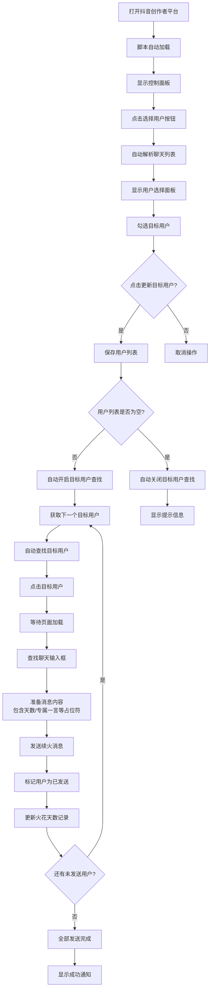

> **📝 AI 文档声明**：本文档由 AI 辅助生成和优化，内容基于项目源码与功能设计整理。虽然经过人工校对，但仍可能存在细节偏差或版本不同步的情况。如发现任何错误或过时信息，欢迎通过 [GitHub Issues](https://github.com/dr-190/ScriptCat-Douyin-Fire-Helper/issues) 提交反馈，我们会及时修正。

# ScriptCat-Douyin-Fire-Helper 🔥 抖音续火助手

> 🚀 一款专为抖音设计的自动化续火脚本，支持多用户批量发送、一言API、专属文案、随机时间、智能重试，配合后端调度器实现 7×24 小时无人值守。

📌 **快速导航**：[星火云 · 抖音续火云端自动化平台 · 1.5元/月](https://dyxh.503555.xyz) · [功能特性](#-功能特性) · [界面预览](#-界面预览) · [油猴脚本安装与使用](#-油猴脚本安装与使用教程) · [调度器管理器安装与使用](#-调度器管理器安装与使用教程) · [完整协同部署流程](#-完整协同部署流程) · [挂机方案](#-挂机方案) · [配置说明](#-配置说明) · [更新日志](#-更新日志) · [故障排除](#-故障排除) · [贡献指南](#-贡献指南)

[](https://github.com/dr-190/ScriptCat-Douyin-Fire-Helper/blob/main/LICENSE)
[](https://github.com/dr-190/ScriptCat-Douyin-Fire-Helper/stargazers)
[](https://github.com/dr-190/ScriptCat-Douyin-Fire-Helper/releases)
[](https://www.tampermonkey.net/)
[](https://docs.scriptcat.org/)
[](https://github.com/dr-190/ScriptCat-Douyin-Fire-Helper/issues)

---

## ✨ 功能特性

### 核心能力

| 模块 | 功能 | 说明 |
|------|------|------|
| 🔥 火花天数 | `[天数]` 占位符 | 自动记录每位好友的火花持续天数，每天首次发送自动 +1 |
| 💫 专属一言 | `[专属一言]` 占位符 | 按周一~周日配置专属文案，支持随机/顺序发送，防重复 |
| 🎲 随机时间 | 跨天时间范围 | 在指定区间内每日随机选取发送时间，避免固定模式 |
| 👥 多用户批量 | 可视化选择 | 自动解析聊天列表，支持全选/去重/状态标识 |
| 🔄 智能重试 | 自动重置 | 10 分钟自动重试 + 定时重置，重试计数持久化 |
| 🎯 用户查找 | 多层点击策略 | 直接点击 + 事件触发，防抖节流避免卡顿 |
| 📊 观察器监控 | 详细状态 | 运行时长、DOM 变化、停止原因实时统计 |
| ⏸️ 暂停/继续 | 状态持久化 | 随时暂停或恢复，页面刷新后保留状态 |
| 🔗 调度器回调 | HTTP 通知 | 任务完成自动通知后端，支持多账号无人值守 |

### 消息内容能力

- **一言 API 集成**：自动获取优美句子，支持 `{hitokoto}` / `{from}` / `{from_who}` 变量
- **TXTAPI 支持**：API 模式 / 手动模式，每行一条文本，随机或顺序发送
- **消息模板**：自由组合 `[API]` / `[TXTAPI]` / `[天数]` / `[专属一言]` 占位符，支持多行

### 界面与交互

- 抖音风格深色主题 UI，可拖拽控制面板
- 功能分类设置面板，关闭后可一键重新打开
- 桌面通知 + 完整历史日志（默认 200 条，支持导出）

### 性能优化

- 智能 DOM 观察器，最大 50 次查找限制防死循环
- 防抖 500ms / 节流 1000ms 默认参数，可调
- 发送冷却期 3 秒，防频繁重试 5 秒
- 所有操作均含超时控制，避免无限等待

---

## 🖼️ 界面预览

<div align="center">

| 控制面板 | 设置界面 |
|---------|---------|
|  |  |

| 用户选择面板 | 历史日志 |
|------------|---------|
|  |  |

</div>

### 多用户发送流程


```mermaid
graph TD
    A[打开抖音创作者平台] --> B[脚本自动加载]
    B --> C[显示控制面板]
    C --> D[点击选择用户按钮]
    D --> E[自动解析聊天列表]
    E --> F[显示用户选择面板]
    F --> G[勾选目标用户]
    G --> H{点击更新目标用户?}
    H -->|是| I[保存用户列表]
    H -->|否| J[取消操作]
    I --> K{用户列表是否为空?}
    K -->|是| L[自动关闭目标用户查找]
    K -->|否| M[自动开启目标用户查找]
    M --> N[获取下一个目标用户]
    N --> O[自动查找目标用户]
    O --> P[点击目标用户]
    P --> Q[等待页面加载]
    Q --> R[查找聊天输入框]
    R --> S[准备消息内容<br/>包含天数/专属一言等占位符]
    S --> T[发送续火消息]
    T --> U[标记用户为已发送]
    U --> V[更新火花天数记录]
    V --> W{还有未发送用户?}
    W -->|是| N
    W -->|否| X[全部发送完成]
    X --> Y[显示成功通知]
    L --> Z[显示提示信息]
```

---

## 📥 油猴脚本安装与使用教程

> 本章节涵盖油猴脚本从零开始的完整安装与使用流程，包括浏览器、脚本管理器等所有依赖的安装。

### 第一步：安装浏览器

推荐使用以下任一浏览器以保证最佳兼容性：

| 浏览器 | 推荐指数 | 说明 | 下载地址 |
|--------|---------|------|---------|
| **百分浏览器** | ⭐⭐⭐ | 挂机首选，内存占用低，内置 Chromium 内核 | [官网下载](https://www.centbrowser.cn/) |
| **Chrome** | ⭐⭐⭐ | 官方 Chromium 内核，兼容性最好 | [官网下载](https://www.google.com/chrome/) |
| **Edge** | ⭐⭐ | Windows 自带，无需额外安装 | [官网下载](https://www.microsoft.com/edge) |
| **Firefox** | ⭐⭐ | 支持 ESR 长期支持版，隐私性好 | [官网下载](https://www.mozilla.org/firefox/) |

> 💡 **挂机建议**：如果需要长时间 7×24 挂机，强烈推荐百分浏览器，内存占用显著低于 Chrome。

### 第二步：安装脚本管理器

脚本管理器是运行油猴脚本的前提条件，**任选其一安装即可**：

#### 选项 A：ScriptCat（⭐ 推荐）

ScriptCat 对定时任务和多标签管理支持更好，适合挂机场景。

| 浏览器 | 安装方式 |
|--------|---------|
| Chrome | [Chrome 商店安装](https://chromewebstore.google.com/detail/scriptcat/ndcoemabapkfhkbgmlokcnnnjhlfkbbm) |
| Edge | [Edge 商店安装](https://microsoftedge.microsoft.com/addons/detail/scriptcat/jojjigklliiembeemkgeingglbpdgocl) |
| Firefox | [Firefox 商店安装](https://addons.mozilla.org/firefox/addon/scriptcat/) |

> 📖 详细安装文档可参考 [ScriptCat 官方安装指南](https://docs.scriptcat.org/docs/install/)

#### 选项 B：Tampermonkey（油猴）

全球最流行的脚本管理器，生态最完善。

| 浏览器 | 安装方式 |
|--------|---------|
| Chrome | [Chrome 商店安装](https://chrome.google.com/webstore/detail/tampermonkey/dhdgffkkebhmkfjojejmpbldmpobfkfo) |
| Edge | [Edge 商店安装](https://microsoftedge.microsoft.com/addons/detail/tampermonkey/iikmkjmpaadaobahmlepeloendndfphd) |
| Firefox | [Firefox 商店安装](https://addons.mozilla.org/firefox/addon/tampermonkey/) |

> ⚠️ **验证安装**：安装完成后，点击浏览器工具栏应出现脚本管理器图标（ScriptCat 为猫爪图标，Tampermonkey 为黑色方块图标）。

### 第三步：安装抖音续火脚本

#### 方式一：一键安装（推荐）

[](https://scriptcat.org/scripts/code/4141/%E6%8A%96%E9%9F%B3%E7%BB%AD%E7%81%AB%E8%8A%B1%E8%87%AA%E5%8A%A8%E5%8F%91%E9%80%81%E5%8A%A9%E6%89%8B-%E9%9B%86%E6%88%90%E4%B8%80%E8%A8%80API%E5%92%8CTXTAPI.user.js)

点击上方按钮，脚本管理器会自动识别并弹出安装确认页，确认脚本权限后点击「安装」即可。

#### 方式二：手动安装

适用于无法访问脚本仓库或一键安装失败的情况：

1. 前往 [Releases 页面](https://github.com/dr-190/ScriptCat-Douyin-Fire-Helper/releases/latest)，下载 `scriptcat-douyin-fire-helper.user.js` 文件
2. 点击浏览器工具栏的脚本管理器图标 → 「添加新脚本」/「Create a new script」
3. **清空编辑器中所有默认内容**
4. 打开下载的 `.user.js` 文件，将全部内容复制粘贴到编辑器中
5. 按 `Ctrl + S`（Mac 为 `Cmd + S`）保存
6. 确认脚本列表中该脚本状态为「已启用」

#### 方式三：通过 GitHub Raw 链接安装

在脚本管理器中点击「+」或「添加新脚本」，在编辑器上方的 URL 输入框中粘贴以下链接并回车：

```
https://raw.githubusercontent.com/dr-190/ScriptCat-Douyin-Fire-Helper/main/scriptcat-douyin-fire-helper.user.js
```

### 第四步：验证脚本是否生效

1. 打开 [抖音创作者平台私信页](https://creator.douyin.com/creator-micro/data/following/chat) 或 [抖音 Chat 页面](https://www.douyin.com/chat)
2. 等待 2-3 秒，页面右上角应自动出现 **抖音风格的深色控制面板**
3. 如果未出现，请按 `F12` 打开开发者工具查看控制台是否有报错

### 第五步：基础使用

#### 5.1 选择目标用户

1. 点击控制面板上的「**选择用户**」按钮
2. 脚本自动解析当前聊天列表中的好友，弹出用户选择面板
3. 勾选需要续火的好友（支持全选/取消全选）
4. 点击「**更新目标用户**」保存选择

#### 5.2 配置发送内容与时间

1. 点击控制面板上的「**设置**」按钮进入设置面板
2. **基本设置**：配置每日发送时间（默认 `00:01:00`）或开启随机时间模式
3. **消息模板**：配置发送内容，支持以下占位符自由组合：

| 占位符 | 作用 | 示例 |
|--------|------|------|
| `[天数]` | 自动替换为当前火花天数 | `第[天数]天` → `第15天` |
| `[专属一言]` | 自动替换为当天星期对应文案 | 见下方配置 |
| `[API]` | 自动获取一言 API 句子 | 随机优美句子 |
| `[TXTAPI]` | 从自定义文本/API 随机获取 | 自定义文案 |

> 📝 **模板示例**：`第[天数]天，[专属一言][API]` → 实际发送：`第15天，周一快乐今天天气真不错樱花飘落的季节总是让人心生欢喜`

4. **专属一言配置**（可选）：在「专属一言」选项卡中，按周一~周日分别填写文案，选择随机或顺序发送模式
5. 配置完成后关闭设置面板，设置自动保存

#### 5.3 启动自动化

1. 确认设置无误后，脚本将在指定时间自动执行
2. 可随时通过控制面板的「**暂停/继续**」按钮控制运行状态
3. 在「**历史日志**」中查看发送记录和运行状态

### 第六步：浏览器保持活跃设置（⚠️ 重要）

为避免浏览器后台休眠导致脚本停止，**必须**配置以下设置（以 Chrome/百分浏览器为例）：

1. 打开浏览器设置 → 搜索「**性能**」或进入 `chrome://settings/performance`
2. 找到「**始终让以下网站保持活跃状态**」选项
3. 点击「添加」，分别添加：
   - `creator.douyin.com`
   - `www.douyin.com`
4. 保存设置

**Edge 浏览器**：设置 → 系统和性能 → 「从不进入睡眠状态的这些站点」中添加上述域名。

**Firefox 浏览器**：安装 [Auto Tab Discard](https://addons.mozilla.org/firefox/addon/auto-tab-discard/) 扩展，将上述域名加入白名单。

### 油猴脚本常见问题

<details>
<summary><b>Q：脚本安装后不显示控制面板？</b></summary>

1. 确认脚本管理器中该脚本状态为「已启用」
2. 刷新页面，等待 2-3 秒
3. 按 `F12` 打开控制台查看是否有红色报错
4. 确认当前页面 URL 为 `creator.douyin.com/...` 或 `www.douyin.com/chat`
5. 检查脚本管理器是否允许该脚本在当前页面运行

</details>

<details>
<summary><b>Q：一键安装按钮点击无反应？</b></summary>

1. 确认已安装脚本管理器（ScriptCat 或 Tampermonkey）
2. 尝试使用「手动安装」或「GitHub Raw 链接安装」方式
3. 检查浏览器是否拦截了弹出窗口
4. 如果使用 ScriptCat，尝试在 ScriptCat 设置中开启「允许外部安装」

</details>

<details>
<summary><b>Q：消息模板中的占位符没有被替换？</b></summary>

1. 检查占位符格式：必须使用半角方括号 `[天数]`，不能是全角 `［天数］`
2. 确认对应功能已启用（如使用 `[API]` 需开启一言 API）
3. 查看历史日志中消息生成的详细过程
4. API 相关占位符需网络正常才能获取内容

</details>

<details>
<summary><b>Q：随机时间模式不生效？</b></summary>

1. 确认已开启「启用随机时间」开关
2. 检查时间格式必须为 `HH:mm:ss`（如 `23:00:00`）
3. 查看控制面板显示的「下次发送时间」是否为随机值
4. 刷新页面重新加载脚本配置

</details>

---

## 💻 调度器管理器安装与使用教程

> 本章节涵盖后端调度器和图形化综合管理器从零开始的完整安装与使用流程，实现多账号 7×24 小时无人值守。

### 架构说明

```
┌──────────────────────────────────────────────────────┐
│                  调度器管理器                          │
│  ┌─────────────────┐    ┌──────────────────────────┐  │
│  │  综合管理器 (GUI) │    │  后端调度器   │  │
│  │  Windows 专用     │───▶│  跨平台命令行            │  │
│  │  可视化操作       │    │  顺序执行多账号          │  │
│  └─────────────────┘    └──────────┬───────────────┘  │
│                                    │                  │
│                         ┌──────────▼───────────────┐  │
│                         │  Python 回调服务器        │  │
│                         │  接收脚本完成通知         │  │
│                         │  端口: 7788              │  │
│                         └──────────┬───────────────┘  │
└────────────────────────────────────┼──────────────────┘
                                     │ HTTP POST
                                     ▼
┌──────────────────────────────────────────────────────┐
│  浏览器实例（独立 Profile，互不干扰）                   │
│  ┌──────────┐  ┌──────────┐  ┌──────────┐           │
│  │ 账号 A   │  │ 账号 B   │  │ 账号 C   │  ...      │
│  │ 油猴脚本 │  │ 油猴脚本 │  │ 油猴脚本 │           │
│  └──────────┘  └──────────┘  └──────────┘           │
└──────────────────────────────────────────────────────┘
```

### 第一步：安装系统依赖

#### 1.1 安装 Python 3（必需）

回调服务器依赖 Python 3 运行环境。

**Windows**：
1. 前往 [Python 官网](https://www.python.org/downloads/) 下载最新 Python 3 安装包
2. 运行安装程序，**务必勾选「Add Python to PATH」**（否则后续命令会报错）
3. 点击「Install Now」完成安装
4. 验证：打开 CMD 或 PowerShell，输入 `python --version`，应显示 `Python 3.x.x`

**Linux (Ubuntu/Debian)**：
```bash
sudo apt update && sudo apt install -y python3 python3-pip
# 验证
python3 --version
```

**Linux (CentOS/RHEL)**：
```bash
sudo yum install -y python3 python3-pip
# 验证
python3 --version
```

**macOS**：
```bash
# 使用 Homebrew 安装（推荐）
brew install python
# 验证
python3 --version
```

> ⚠️ **版本要求**：Python 3.7 及以上版本。低于此版本可能导致部分语法不兼容。

#### 1.2 安装 jq（Linux/macOS 必需，Windows 可选）

Linux/macOS 下的调度器 Shell 脚本依赖 `jq` 处理 JSON 数据。

**Ubuntu/Debian**：
```bash
sudo apt install -y jq
```

**CentOS/RHEL**：
```bash
sudo yum install -y jq
```

**macOS**：
```bash
brew install jq
```

**Windows**：Windows 调度器使用 PowerShell 原生 `ConvertFrom-Json`，**无需安装 jq**。

#### 1.3 依赖检查清单

安装完成后，请确认以下命令均可正常执行：

| 命令 | Windows | Linux/macOS | 预期输出 |
|------|---------|-------------|---------|
| `python --version` 或 `python3 --version` | ✅ | ✅ | `Python 3.x.x` |
| `jq --version` | — | ✅ | `jq-1.x` |
| `powershell -Version`（仅 Windows） | ✅ | — | PowerShell 版本号 |

### 第二步：获取文件

1. 前往 [Releases 页面](https://github.com/dr-190/ScriptCat-Douyin-Fire-Helper/releases/latest)
2. 下载最新版 **`配套工具`** 压缩包
3. 解压到任意目录（**路径中不要包含中文或空格**，如 `D:\Tools\抖音续火\配套工具\`）

解压后的目录结构：

```text
配套工具/
├── shell/                          # 调度器核心文件
│   ├── callback_server.py          # Python HTTP 回调服务器
│   ├── scheduler.ps1               # Windows 调度器脚本
│   ├── scheduler.sh                # Linux/macOS 调度器脚本
│   ├── config.json                 # 调度器配置文件（★ 核心配置）
│   └── logs/                       # 调度器日志目录（自动生成）
├── profiles/                       # 浏览器 Profile 存放目录（自动生成）
├── manager_history.log             # 管理器操作日志（自动生成）
└── 抖音续火综合管理器.pyw          # Windows 图形化管理工具 v1.0
```

> 💡 **关于 `profiles/` 目录**：存放每个抖音账号的独立浏览器配置（Cookie、登录态等），首次运行时自动创建。**位于 `配套工具/profiles/`**，而非 `shell/` 子目录下。

> 💡 **关于综合管理器的位置**：`抖音续火综合管理器.pyw` 可以放在任意目录运行。**但请注意**：综合管理器会在 **其自身所在的目录** 下生成 `profiles/` 文件夹和 `manager_history.log`。如果将管理器放在项目根目录，则 `profiles/` 会在根目录生成；如果放在 `配套工具/` 目录（默认位置），则在 `配套工具/profiles/` 生成。**请保持管理器位置与调度器期望的 profiles 路径一致**，推荐保持默认位置不变。

### 第三步：配置调度器

编辑 `配套工具/shell/config.json`，这是调度器的核心配置文件：

```jsonc
{
  // 全局默认发送时间
  "send_time": "00:01:00",

  // 回调服务器端口（必须与油猴脚本中设置的一致）
  "callback_port": 7788,

  // 默认浏览器类型
  // 可选值: "centbrowser" | "chrome" | "firefox" | "firefox-esr" | "edge"
  "default_browser": "centbrowser",

  // 各浏览器可执行文件路径（留空则自动检测）
  "browser_paths": {
    "centbrowser": "",
    "chrome": "",
    "firefox": "",
    "firefox-esr": "",
    "edge": ""
  },

  // 目标页面 URL
  // 可选: "creator" (creator.douyin.com) 或 "chat" (www.douyin.com/chat)
  "target_url": "creator",

  // 账号列表（每个账号使用独立的浏览器 Profile）
  "accounts": [
    {
      "name": "账号1",              // 账号备注名（仅用于日志显示）
      "profile": "account1",        // Profile 文件夹名称（对应 配套工具/profiles/ 下的子目录）
      "send_time": "00:01:00",      // 可选，不填则使用全局 send_time
      "browser": ""                 // 可选，不填则使用全局 default_browser
    },
    {
      "name": "账号2",
      "profile": "account2",
      "send_time": "00:05:00"
    }
  ]
}
```

#### 关键配置说明

| 配置项 | 必填 | 说明 |
|--------|------|------|
| `callback_port` | ✅ | 回调监听端口，默认 `7788`，**必须与油猴脚本设置中的端口一致** |
| `default_browser` | ✅ | 浏览器类型，挂机推荐 `centbrowser` |
| `browser_paths` | ❌ | 各浏览器路径，留空自动检测。如果自动检测失败需手动填写绝对路径 |
| `target_url` | ✅ | `creator` 或 `chat`，决定打开哪个抖音页面 |
| `accounts` | ✅ | 至少配置一个账号 |
| `accounts[].profile` | ✅ | Profile 目录名，**每个账号必须不同**，否则会互相干扰。对应 `配套工具/profiles/` 下的子目录名 |
| `accounts[].send_time` | ❌ | 可为每个账号设置不同的发送时间，留空使用全局时间 |

#### 浏览器路径自动检测逻辑

如果 `browser_paths` 留空，调度器会按以下顺序自动查找：

| 浏览器 | Windows 检测路径 | Linux 检测路径 | macOS 检测路径 |
|--------|-----------------|---------------|---------------|
| centbrowser | `%LOCALAPPDATA%\CentBrowser\Application\centbrowser.exe` | — | — |
| chrome | `%PROGRAMFILES%\Google\Chrome\Application\chrome.exe` | `/usr/bin/google-chrome` | `/Applications/Google Chrome.app/Contents/MacOS/Google Chrome` |
| firefox | `%PROGRAMFILES%\Mozilla Firefox\firefox.exe` | `/usr/bin/firefox` | `/Applications/Firefox.app/Contents/MacOS/firefox` |
| edge | `%PROGRAMFILES(x86)%\Microsoft\Edge\Application\msedge.exe` | `/usr/bin/microsoft-edge` | `/Applications/Microsoft Edge.app/Contents/MacOS/Microsoft Edge` |

> ⚠️ 如果浏览器安装在非默认位置（如 D 盘），**必须**在 `browser_paths` 中手动填写完整路径。

### 第四步：创建浏览器 Profile 并登录账号

每个抖音账号需要独立的浏览器 Profile（相当于独立的浏览器实例，Cookie/登录态互不干扰）。

所有 Profile 统一存放在 **`配套工具/profiles/`** 目录下，每个账号一个子文件夹：

```text
配套工具/profiles/
├── account1/    # 对应 config.json 中 "profile": "account1"
├── account2/    # 对应 config.json 中 "profile": "account2"
└── account3/    # 对应 config.json 中 "profile": "account3"
```

#### 方式一：使用综合管理器（Windows 推荐）

详见下方「第五步」。

#### 方式二：手动创建

1. 在 `配套工具/profiles/` 目录下，为每个账号创建一个子文件夹（如 `account1`、`account2`）
2. 使用对应浏览器以指定 Profile 启动并登录抖音：

   **Windows (PowerShell)**：
   ```powershell
   # 以 centbrowser 为例，替换为你的实际浏览器路径和配套工具路径
   & "C:\Path\To\centbrowser.exe" --user-data-dir="D:\Tools\抖音续火\配套工具\profiles\account1" "https://creator.douyin.com"
   ```

   **Linux/macOS (Terminal)**：
   ```bash
   # 以 chrome 为例
   google-chrome --user-data-dir="/path/to/配套工具/profiles/account1" "https://creator.douyin.com"
   ```

3. 在打开的浏览器中登录对应的抖音账号
4. **确认登录成功后关闭浏览器**，Profile 会自动保存登录状态

> 💡 **提示**：只需首次登录一次，之后调度器会自动使用已保存的登录状态。

### 第五步：使用综合管理器（Windows GUI 推荐）

如果你使用 Windows 系统，**强烈推荐**使用图形化管理器，无需记忆任何命令。

> ⚠️ **位置提醒**：默认情况下综合管理器位于 `配套工具/` 目录中，此时 `profiles/` 也会在 `配套工具/` 下生成，与调度器的路径预期一致。**如果你将管理器移动到其他位置，请确保调度器配置中的 profiles 路径能够正确找到管理器生成的 profiles 目录**。

#### 5.1 启动管理器

双击运行 `抖音续火综合管理器.pyw`

> ⚠️ 首次启动需要 Python 环境。如果双击无反应，尝试在命令行中运行：`python "抖音续火综合管理器.pyw"` 查看报错信息。

> 📝 首次启动会在管理器 **所在目录** 下自动生成 `profiles/` 文件夹和默认配置文件。

#### 5.2 管理账号 Profile

1. 切换到「**账号管理**」标签页
2. 点击「**新建空白账号**」创建新账号条目，或点击「**克隆账号**」基于现有账号复制
3. 选中账号后点击「**启动浏览器**」，会以该账号的独立 Profile 打开浏览器
4. 在浏览器中登录对应的抖音账号，登录成功后关闭浏览器

#### 5.3 配置调度参数

1. 切换到「**调度配置**」标签页
2. 设置全局参数：
   - **调度器端口**：默认 7788，需与油猴脚本一致
   - **默认浏览器**：选择 centbrowser/chrome/firefox/edge
3. 在账号列表中，为每个账号单独配置：
   - **发送时间**：可覆盖全局设置
   - **浏览器类型**：可覆盖全局设置
   - **Profile 路径**：自动关联账号管理中创建的 Profile

#### 5.4 启动调度器

1. 确认所有账号已登录、配置已填写
2. 点击「**启动调度器**」按钮
3. 管理器会自动调用 `shell/scheduler.ps1`，在下方日志区域实时显示运行状态
4. 所有操作记录会同步保存在 `manager_history.log` 中

#### 5.5 停止调度器

点击「**停止调度器**」按钮，当前正在执行的任务会等待当前账号完成（或超时）后停止。

### 第六步：使用命令行调度器（Linux/macOS/Windows 高级用户）

#### 6.1 Windows (PowerShell)

```powershell
# 进入调度器目录
cd "D:\Tools\抖音续火\配套工具\shell"

# 守护进程模式（推荐挂机使用，单个账号完成后自动切换下一个）
.\scheduler.ps1

# 单次执行模式（仅执行一次，用于测试）
.\scheduler.ps1 -Mode once
```

> ⚠️ 如果遇到执行策略限制，先运行：`Set-ExecutionPolicy -Scope CurrentUser RemoteSigned`

#### 6.2 Linux / macOS (Terminal)

```bash
# 进入调度器目录
cd /path/to/配套工具/shell

# 首次运行需赋予执行权限
chmod +x scheduler.sh

# 守护进程模式（推荐挂机使用）
./scheduler.sh

# 单次执行模式（测试用）
./scheduler.sh once
```

#### 6.3 后台运行

**Linux**（使用 nohup 后台运行，关闭终端也不会停止）：
```bash
nohup ./scheduler.sh > /dev/null 2>&1 &
# 查看进程
ps aux | grep scheduler
# 停止
kill <PID>
```

**Linux**（使用 systemd 服务，开机自启）：
```bash
# 创建服务文件
sudo tee /etc/systemd/system/douyin-fire.service << 'EOF'
[Unit]
Description=Douyin Fire Helper Scheduler
After=network.target

[Service]
Type=simple
User=你的用户名
WorkingDirectory=/path/to/配套工具/shell
ExecStart=/path/to/配套工具/shell/scheduler.sh
Restart=always
RestartSec=60

[Install]
WantedBy=multi-user.target
EOF

# 启用并启动服务
sudo systemctl daemon-reload
sudo systemctl enable douyin-fire
sudo systemctl start douyin-fire

# 查看状态
sudo systemctl status douyin-fire
# 查看日志
journalctl -u douyin-fire -f
```

**macOS**（使用 launchd）：
```bash
# 创建 plist 文件
cat > ~/Library/LaunchAgents/com.douyin.fire.helper.plist << 'EOF'
<?xml version="1.0" encoding="UTF-8"?>
<!DOCTYPE plist PUBLIC "-//Apple//DTD PLIST 1.0//EN" "http://www.apple.com/DTDs/PropertyList-1.0.dtd">
<plist version="1.0">
<dict>
    <key>Label</key>
    <string>com.douyin.fire.helper</string>
    <key>ProgramArguments</key>
    <array>
        <string>/path/to/配套工具/shell/scheduler.sh</string>
    </array>
    <key>WorkingDirectory</key>
    <string>/path/to/配套工具/shell</string>
    <key>RunAtLoad</key>
    <true/>
    <key>KeepAlive</key>
    <true/>
    <key>StandardOutPath</key>
    <string>/path/to/配套工具/shell/logs/launchd.log</string>
    <key>StandardErrorPath</key>
    <string>/path/to/配套工具/shell/logs/launchd.err</string>
</dict>
</plist>
EOF

# 加载服务
launchctl load ~/Library/LaunchAgents/com.douyin.fire.helper.plist
# 查看状态
launchctl list | grep douyin
# 停止服务
launchctl unload ~/Library/LaunchAgents/com.douyin.fire.helper.plist
```

### 第七步：油猴脚本端配合设置

调度器启动后，还需要在油猴脚本中启用回调功能，两者才能协同工作：

1. 在浏览器中打开抖音页面，等待油猴脚本控制面板出现
2. 点击「**设置**」按钮
3. 找到「**启用后端调度器回调**」选项，**开启**
4. 确认回调端口与 `config.json` 中的 `callback_port` 一致（默认 `7788`）
5. 关闭设置面板，配置自动保存

> 💡 **此配置只需在每个 Profile 的浏览器中设置一次**，之后会持久化保存。

### 调度器管理器常见问题

<details>
<summary><b>Q：运行 scheduler.ps1 报错「无法加载，因为在此系统上禁止运行脚本」？</b></summary>

这是 PowerShell 执行策略限制。以管理员身份打开 PowerShell，运行：
```powershell
Set-ExecutionPolicy -Scope CurrentUser RemoteSigned
```
然后重新执行调度器脚本。

</details>

<details>
<summary><b>Q：运行 scheduler.sh 报错 "jq: command not found"？</b></summary>

Linux/macOS 需要安装 jq：
```bash
# Ubuntu/Debian
sudo apt install jq
# CentOS/RHEL
sudo yum install jq
# macOS
brew install jq
```

</details>

<details>
<summary><b>Q：运行 scheduler.sh 报错 "python3: command not found"？</b></summary>

部分系统 Python 3 命令为 `python` 而非 `python3`。创建软链接：
```bash
sudo ln -s /usr/bin/python3 /usr/bin/python
```
或直接修改 `scheduler.sh` 中的 `python3` 为 `python`。

</details>

<details>
<summary><b>Q：浏览器启动后闪退或无法打开？</b></summary>

1. 检查 `config.json` 中 `browser_paths` 路径是否正确（包含完整的 `.exe` 路径）
2. 尝试在终端中手动执行浏览器路径，确认可执行文件存在
3. Windows 检查路径中的反斜杠是否需要转义（JSON 中用 `\\` 或 `/`）
4. Linux 检查浏览器是否有 `--no-sandbox` 权限问题（root 用户运行需要加此参数）

</details>

<details>
<summary><b>Q：浏览器打开后抖音显示未登录？</b></summary>

1. 确认 `配套工具/profiles/` 目录中对应账号的 Profile 文件夹确实已保存登录状态
2. 检查 `config.json` 中 `profile` 字段与 `配套工具/profiles/` 下的目录名是否完全一致
3. 确认没有多个调度器实例同时使用同一个 Profile（会导致 Cookie 冲突）
4. 重新使用对应 Profile 启动浏览器并登录

</details>

<details>
<summary><b>Q：回调失败，日志显示「后端调度器不可达」？</b></summary>

1. 确认回调服务器已启动（调度器启动时会自动启动）
2. 在浏览器中访问 `http://localhost:7788`，应返回响应
3. 检查 `config.json` 中 `callback_port` 与油猴脚本设置中的端口是否一致
4. 检查本地防火墙是否阻止了端口 7788
5. 如果端口被占用，修改 `config.json` 和油猴脚本设置中的端口为其他未被占用的端口

</details>

<details>
<summary><b>Q：端口 7788 被占用怎么办？</b></summary>

**Windows** 查找占用进程：
```powershell
netstat -ano | findstr :7788
taskkill /PID <进程ID> /F
```

**Linux/macOS** 查找占用进程：
```bash
lsof -i :7788
kill -9 <PID>
```

或者修改 `config.json` 和油猴脚本设置中的端口为其他值（如 `8899`）。

</details>

<details>
<summary><b>Q：综合管理器双击无反应？</b></summary>

1. 确认已安装 Python 3 且已添加到 PATH
2. 在命令行中运行 `python "抖音续火综合管理器.pyw"` 查看报错
3. 如果提示缺少 tkinter 模块：
   - Windows：重新运行 Python 安装程序，勾选 `tcl/tk and IDLE`
   - Linux：`sudo apt install python3-tk`
   - macOS：`brew install python-tk`

</details>

<details>
<summary><b>Q：调度器执行完一个账号后卡住，不切换下一个？</b></summary>

1. 检查油猴脚本是否已启用「后端调度器回调」
2. 检查回调端口是否一致
3. 查看 `shell/logs/` 下的日志文件，确认回调服务器是否收到请求
4. 检查浏览器是否正常关闭（某些情况下浏览器进程可能残留）

</details>

<details>
<summary><b>Q：Linux 无桌面环境下如何运行？</b></summary>

需要安装虚拟显示器：
```bash
sudo apt install xvfb
# 使用 xvfb-run 启动调度器
xvfb-run ./scheduler.sh
```

或在 `browser_paths` 中为 Chrome 添加 `--headless` 参数（注意：headless 模式下抖音页面可能无法正常工作，不建议使用）。

</details>

<details>
<summary><b>Q：我把综合管理器移到了其他目录，profiles 在哪生成？</b></summary>

综合管理器会在 **它自身所在的目录** 下生成 `profiles/` 文件夹。例如：
- 管理器在 `配套工具/` → profiles 在 `配套工具/profiles/` ✅（默认，与调度器一致）
- 管理器在项目根目录 → profiles 在 `项目根目录/profiles/` ⚠️（调度器找不到）
- 管理器在桌面 → profiles 在 `桌面/profiles/` ⚠️（调度器找不到）

**如果移动了管理器，需要同步修改调度器的 profiles 路径配置，或通过符号链接将 profiles 目录关联到 `配套工具/profiles/`**。

</details>

---

## 🔄 完整协同部署流程

> 以下是从零开始部署多账号无人值守方案的完整流程清单，按顺序执行即可。

### 单账号方案（无需调度器）

```
安装浏览器 → 安装脚本管理器 → 安装油猴脚本 → 打开抖音页面 → 选择用户 → 配置模板 → 设置定时 → 保持浏览器活跃 ✅
```

### 多账号无人值守方案

```
1. 环境准备
   ├── 安装浏览器（所有账号使用同一种浏览器）
   ├── 安装脚本管理器
   ├── 安装 Python 3
   └── 安装 jq（Linux/macOS）

2. 油猴脚本部署
   ├── 安装抖音续火脚本
   └── 打开抖音页面验证脚本生效

3. 调度器部署
   ├── 下载并解压配套工具
   ├── 编辑 配套工具/shell/config.json 配置账号列表
   ├── 在 配套工具/profiles/ 下为每个账号创建独立 Profile
   ├── 在每个 Profile 的浏览器中登录对应抖音账号
   └── 在每个 Profile 中启用油猴脚本的「后端调度器回调」

4. 启动运行
   ├── Windows: 启动综合管理器 → 点击「启动调度器」
   └── Linux/macOS: 终端运行 ./scheduler.sh（或配置 systemd/launchd 开机自启）

5. 验证
   ├── 查看调度器日志，确认第一个账号浏览器已启动
   ├── 确认油猴脚本控制面板正常显示
   ├── 等待脚本执行完成，确认回调成功
   └── 确认调度器自动关闭第一个浏览器并启动第二个 ✅
```

---

## 💻 挂机方案

### 方案对比

| 平台 | 配置 | 价格 | 特点 |
|------|------|------|------|
| ⭐ **星火云平台（推荐）** | 无需本地设备 | **1.5 元/月** | 真正的 SaaS 云端，无需下载软件，无需保持电脑开机 |
| 阿里云轻量服务器 | 1 核 1G / 20GB | ≈24 元/月 | 稳定可靠，性能强劲 |
| 腾讯云轻量服务器 | 1 核 1G / 25GB | ≈25 元/月 | 网络优化，访问快速 |
| 专业挂机宝 | 基础配置 | ≈10-20 元/月 | 专为挂机优化，价格低廉 |

### ☁️ 星火云 · 抖音续火云端自动化平台

为仅需续火花脚本的用户提供的 SaaS 云端服务，无需下载软件、无需保持电脑开机，7×24 小时云端自动执行。

**🔗 购买地址**：<https://dyxh.503555.xyz>

**核心特性**

- 🌐 **全自动云端运行**：彻底解放双手，无需本地挂机
- ⏰ **智能定时调度**：支持 Cron 表达式自定义执行时间
- 👥 **多账号统一管理**：一个面板管理所有抖音账号，按昵称或抖音号匹配
- 📊 **可视化执行日志**：每次执行都有详细日志和统计数据
- 🔒 **企业级安全**：密码 Bcrypt 哈希、Cookies AES 加密、HTTPS 全程加密

**开通流程**

1. 注册账号（邮箱或用户名）
2. 添加抖音账号，安全上传并加密存储 Cookies
3. 创建任务，设置目标好友及定时 Cron 规则
4. 云端自动按时执行，随时查看日志

> 💡 购买后自动开通，无需人工干预。

### 本地挂机部署（传统方式）

1. **购买云服务器**：选择 Windows 系统（推荐 Windows Server），基础配置即可
2. **环境配置**：按上述「完整协同部署流程」安装所有依赖并配置
3. **设置开机自启**：
   - Windows：将调度器快捷方式放入「启动」文件夹（`Win+R` → `shell:startup`）
   - Linux：配置 systemd 服务（见上文）
4. **日常维护**：定期检查运行状态、关注更新通知、备份配置

---

## ⚙️ 配置说明

### 📊 观察器状态

| 配置项 | 默认值 | 说明 |
|--------|--------|------|
| 观察器状态监控 | 开启 | 实时显示运行状态和详细信息 |
| 详细日志记录 | 开启 | 记录启动、运行、停止全过程 |
| 查找尝试限制 | 50 次 | 避免无限循环 |

### 🔥 火花天数

| 配置项 | 默认值 | 说明 |
|--------|--------|------|
| 初始天数 | 1 | 火花初始天数 |
| 天数占位符 | `[天数]` | 模板中自动替换为当前天数 |
| 增加逻辑 | 自动 | 每天首次发送成功 +1 |
| 手动调整 | 支持 | 设置中可手动修改 |

### 💫 专属一言

| 配置项 | 说明 |
|--------|------|
| 启用专属一言 | 开启/关闭功能 |
| 星期文案配置 | 周一~周日分别设置文案 |
| 发送模式 | 随机 / 顺序 |
| 专属占位符 | `[专属一言]` 自动替换为当天文案 |
| 防重复机制 | 每日记录已发送文案，避免重复 |

### 🎲 随机时间

| 配置项 | 格式 | 说明 |
|--------|------|------|
| 启用随机时间 | 开关 | 开启/关闭随机时间模式 |
| 开始时间 | `HH:mm:ss` | 随机时间起始 |
| 结束时间 | `HH:mm:ss` | 随机时间结束，可小于开始时间（跨天） |

### 👤 用户选择

- 点击「选择用户」按钮自动解析当前聊天列表
- 用户分隔符统一为**换行符**
- 支持勾选/取消单用户、全选/取消全选
- 已添加用户默认打勾，点击「更新目标用户」保存

### 🔄 重试设置

| 配置项 | 默认值 | 说明 |
|--------|--------|------|
| 自动重试间隔 | 10 分钟 | 达到最大重试后自动重置的间隔 |
| 启用自动重试 | 开启 | 达到最大重试后自动重置 |
| 定时重置间隔 | 10 分钟 | 定时重置重试计数 |
| 重置重试按钮 | — | 控制面板手动重置按钮 |
| 重试状态持久化 | 开启 | 避免意外重置为 0 |

### 🎯 基本用户设置

| 配置项 | 默认值 | 说明 |
|--------|--------|------|
| 点击方法 | 直接点击 | 直接点击（推荐）/ 事件触发 |
| 查找超时 | 30 秒 | 用户查找最大等待时间 |
| 页面加载等待 | 5000 ms | 点击用户后等待页面加载时间 |

### ⏰ 基本设置

| 配置项 | 默认值 | 说明 |
|--------|--------|------|
| 发送时间 | `00:01:00` | 每日发送时间（HH:mm:ss） |
| 重试次数 | 3 次 | 发送失败最大重试次数（1-10） |
| 聊天框重试限制 | 5 次 | 查找聊天输入框最大重试次数 |
| 初始加载延迟 | 30 秒 | 页面加载后延迟启动自动检测 |

### 🤖 一言 API 设置

| 配置项 | 默认值 | 说明 |
|--------|--------|------|
| 启用一言 API | 开启 | 使用一言 API 获取优美句子 |
| API 超时 | 5000 ms | 请求超时时间 |
| 消息格式 | 自定义 | 支持 `{hitokoto}` / `{from}` / `{from_who}` |

### 📝 TXTAPI 设置

| 配置项 | 说明 |
|--------|------|
| 启用 TXTAPI | 开启/关闭功能 |
| 模式选择 | API 模式（从 URL 获取）/ 手动模式（自定义文本） |
| 随机发送 | 手动模式下是否随机选择 |
| 文本内容 | 每行一个文本，支持换行 |

### ⚡ 性能设置

| 配置项 | 默认值 | 说明 |
|--------|--------|------|
| 防抖延迟 | 500 ms | 控制查找频率 |
| 节流延迟 | 1000 ms | 最小查找间隔 |
| 日志数量 | 200 条 | 最大历史日志数量 |
| 观察器日志级别 | 标准 | 标准 / 详细 |

### 💬 消息模板

- 支持占位符：`[API]` / `[TXTAPI]` / `[天数]` / `[专属一言]`
- 支持换行符，创建多行消息
- API 失败时的备用消息可配置
- 示例：`第[天数]天，[专属一言][API]`

### 🔧 Chat 页面专属配置

| 配置项 | 默认值 | 说明 |
|--------|--------|------|
| Chat 页面换行替换符 | ` \| ` | Chat 页面不支持换行，自动替换 |
| Chat 页面搜索等待 | 动态 | 网络慢时可适当增加超时 |

### 🌐 浏览器配置（调度器专用）

| 配置项 | 默认值 | 说明 |
|--------|--------|------|
| `default_browser` | `centbrowser` | 默认浏览器（`centbrowser`/`chrome`/`firefox`/`firefox-esr`/`edge`） |
| `browser_paths` | 空字符串 | 自定义各浏览器路径，留空则自动检测 |
| `target_url` | `creator.douyin.com` | 目标页面 |

---

## 🏗️ 技术架构

```text
用户界面层
    ├── 控制面板 (状态显示、日志、操作按钮)
    ├── 设置面板 (功能配置、参数调整)
    └── 用户选择面板 (可视化用户选择)
        ↓
业务逻辑层
    ├── 定时调度模块 (固定/随机时间触发)
    ├── 用户管理模块 (多用户批量处理)
    ├── 消息生成模块 (API集成、模板渲染)
    ├── 状态管理模块 (火花天数、发送记录)
    ├── 重试管理模块 (自动重试、定时重置)
    └── 观察器管理模块 (状态监控、详细日志)
        ↓
数据访问层
    ├── 本地存储 (GM_setValue/GM_getValue)
    ├── API接口 (一言API、自定义API)
    └── DOM操作 (抖音网页自动化)
        ↓
抖音网页 API
    ├── 用户查找 (聊天列表解析)
    ├── 消息发送 (输入框操作)
    └── 状态监控 (页面变化监听)

外部工具（调度器 & 管理器）
    ├── 后端调度器 (多账号顺序执行、超时重试)
    ├── 综合管理器 v1.0 (图形化配置、一键控制)
    └── HTTP回调接口 (脚本与调度器通信)
```

### API 集成

- **一言 API**：<https://v1.hitokoto.cn/>
- **自定义 API**：任何返回纯文本的 API 接口
- **抖音网页 API**：通过 DOM 操作实现自动化交互
- **本地回调接口**：`http://localhost:7788/done`（与调度器通信）

### 安全特性

- 本地存储所有配置，无数据收集
- 代码完全开源，权限最小化
- 调度器通信仅限本地回环

---

## 📁 项目结构

```text
ScriptCat-Douyin-Fire-Helper/
├── scriptcat-douyin-fire-helper.user.js  # 主脚本文件 (v2026.07.13)
├── README.md                             # 项目说明文档
├── LICENSE                               # 开源许可证
├── CHANGELOG.md                          # 更新日志
├── images/                               # 项目图片资源
│   ├── screenshot-panel.png
│   ├── screenshot-settings.png
│   ├── screenshot-user-select.png
│   └── screenshot-logs.png
└── 配套工具/
    ├── shell/                            # 调度器核心文件目录
    │   ├── callback_server.py            # Python HTTP 回调服务器
    │   ├── scheduler.ps1                 # Windows 调度器脚本
    │   ├── scheduler.sh                  # Linux/macOS 调度器脚本
    │   └── config.json                   # 调度器配置文件
    ├── profiles/                         # 浏览器 Profile 存放目录（自动生成）
    ├── manager_history.log               # 管理器操作日志（自动生成）
    └── 抖音续火综合管理器.pyw            # Windows 图形化管理工具 v1.0
```

---

## 🚀 更新日志

> 完整历史版本请查看 [Releases](https://github.com/dr-190/ScriptCat-Douyin-Fire-Helper/releases)

### v2026.07.13 🎉 重大更新

**✨ 新增功能**

- **📱 Chat 页面全面支持**：完整支持 `https://www.douyin.com/chat*`，专用搜索、换行输入（Shift+Enter）、自动读取火花天数
- **⏸️ 暂停/继续控制**：随时暂停或恢复自动发送，状态持久化保存
- **👤 用户火花天数独立记录**：每位好友独立记录天数，消息模板自动替换，新增「清空天数」按钮
- **🔗 后端调度器回调集成**：任务完成自动通知调度器，支持 success/all_failed/partial 状态
- **🔄 多用户失败处理优化**：新增 `failedUsersToday` 数组，单用户失败后自动切换下一用户
- **⏱️ 初始加载延迟配置**：默认 30 秒延迟启动，避免页面未完全加载
- **🔧 Chat 页面换行分隔符**：自动将换行符替换为自定义分隔符（默认 ` | `）

**🐛 问题修复**

- 修复查找次数过多时当前用户未标记为失败的问题
- 修复多用户模式下未正确通知后端调度器的问题
- 修复 Chat 页面中文输入法导致的乱码（改用 InputEvent）
- 修复 Chat 页面搜索结果加载慢找不到聊天按钮的问题
- 修复发送完成后冷却期检查逻辑

**⚡ 性能优化**

- 新增发送冷却期（3 秒）与防频繁重试检查（5 秒）
- 优化 Chat 页面元素查找效率
- 精简 Chat 页面查找日志

---

### v2026.04.03 用户查找逻辑修复

- 🐛 修复好友修改昵称导致的查找失败 bug
- 🔍 优化虚拟列表用户选择，采用滚动查找策略
- 🧹 精简冗余逻辑，提升执行效率
- 👥 感谢 [@YsKiKi](https://github.com/YsKiKi) 提交 PR #9

> ⚠️ 已知限制：若存在两个或以上好友昵称相同，优先匹配列表中靠前的用户

---

### v2026.03.22 体验优化与稳定性提升

- 🎯 自动切换全部标签页，确保查找所有目标用户
- 🗑️ 精简冗余日志，提升可读性
- 🔧 修复多标签页切换时的状态管理问题

---

### v3.1.1 观察器状态管理增强

- 📊 新增观察器运行时长、DOM 变化次数、当前目标用户监控
- 🔄 多状态管理（查找中/已找到/发送中），状态持久化
- 📝 明确记录观察器停止原因，每 5 秒记录查找状态
- 🐛 修复"尝试停止聊天观察器但观察器不存在"警告
- 🛡️ 查找尝试次数上限（50 次），避免无限循环
- 🚀 优化 DOM 操作范围，降低性能消耗

---

### v3.1.0 智能重试机制

- 🔧 新增 10 分钟自动重试 + 定时重置功能
- ⏰ 重试计数持久化保存，避免重置为 0
- 🎯 控制面板新增「重置重试」按钮
- 📊 新增「重试设置」选项卡
- 🐛 修复今日状态为「未发送」却不自动发送的问题

---

### v3.0 全面升级

- ✨ **火花天数记录**：`[天数]` 占位符，每日自动 +1
- 💫 **专属一言系统**：按星期配置文案，防重复发送
- 🎲 **随机发送时间**：跨天时间范围支持
- 👥 **用户列表解析**：可视化选择面板，自动去重
- 🎨 界面与交互全面优化

---

### 历史版本

| 版本 | 核心亮点 |
|------|---------|
| v2.3.1 | 多用户时间重置修复，日期检查机制完善 |
| v2.3 | 倒计时状态修复，重试策略完善，「发送中」状态显示 |
| v2.2 | 抖音风格深色主题 UI，面板可拖动 |
| v2.1 | 多用户批量发送，顺序/随机模式，进度可视化 |
| v2.0 | 目标用户自动查找，防抖节流，完整日志系统 |
| v1.0 | 基础定时发送，一言 API 与 TXTAPI 支持 |

> 💡 **升级建议**：强烈推荐升级到 v2026.07.13，新增 Chat 页面支持、暂停控制、用户火花天数独立记录与后端调度器集成。

---

## 🐛 故障排除

> 油猴脚本和调度器的专属常见问题已在各自教程章节中覆盖，以下为其他通用问题。

### Chat 页面问题

<details>
<summary><b>Q：Chat 页面搜索用户提示「未找到搜索输入框」？</b></summary>

1. 确认页面已完全加载，等待 2-3 秒后再试
2. 检查是否在正确的 Chat 页面（<https://www.douyin.com/chat>）
3. 尝试手动点击搜索框激活后再让脚本执行
4. 查看浏览器控制台是否有错误信息

</details>

<details>
<summary><b>Q：Chat 页面发送消息时换行被替换为 <code> | </code>？</b></summary>

这是正常行为，Chat 页面不支持换行。可在设置中修改「Chat 页面换行替换符」自定义分隔符，建议使用空格或逗号。

</details>

<details>
<summary><b>Q：Chat 页面中文输入法导致搜索乱码？</b></summary>

v2026.07.13 已修复此问题（改用 InputEvent 替代 KeyboardEvent）。请升级到最新版本。

</details>

### 暂停与状态

<details>
<summary><b>Q：暂停后重新继续，脚本不发送了？</b></summary>

1. 确认暂停按钮已变为「⏸️ 暂停」状态（绿色按钮）
2. 检查当前时间是否在发送时间范围内
3. 尝试点击「重置重试」按钮手动触发
4. 如仍不工作，刷新页面后重新配置

</details>

### 火花天数与一言

<details>
<summary><b>Q：用户火花天数不更新？</b></summary>

1. 确认已切换到 Chat 页面（仅 Chat 页面支持自动读取）
2. 检查是否已打开与该用户的聊天窗口
3. 右键点击控制面板，查看「用户火花天数」存储状态
4. 可手动点击「修改火花天数」进行调整

</details>

<details>
<summary><b>Q：火花天数不增加？</b></summary>

1. 确认当天是否已发送过消息（每天只增加一次）
2. 查看历史日志了解 `lastFireDate` 记录是否正确
3. 尝试手动修改天数并保存配置
4. 重置今日发送记录后重新发送

</details>

<details>
<summary><b>Q：专属一言重复发送相同文案？</b></summary>

1. 确认是否开启了专属一言防重复机制
2. 检查专属一言的发送模式设置（随机/顺序）
3. 查看历史日志确认当天已发送的文案记录
4. 尝试重置发送记录后重新发送

</details>

### 用户查找与多用户

<details>
<summary><b>Q：多用户模式下某个用户失败后，后续用户不发送了？</b></summary>

v2026.07.13 已修复此问题，失败用户自动标记并继续下一用户。请检查失败用户名是否正确，是否在好友列表中，并查看历史日志了解具体失败原因。

</details>

<details>
<summary><b>Q：用户选择面板显示空白？</b></summary>

1. 确认已打开抖音创作者平台私信页面或 Chat 页面
2. 检查网络连接是否正常
3. 等待页面完全加载后再点击「选择用户」
4. 查看浏览器控制台是否有 DOM 解析错误
5. 尝试刷新页面后重新操作

</details>

<details>
<summary><b>Q：目标用户查找功能自动关闭？</b></summary>

这是 v3.0 的正常行为，当用户列表为空时自动关闭。添加目标用户后功能会自动开启。

</details>

<details>
<summary><b>Q：多用户发送进度卡住？</b></summary>

1. 检查当前用户是否发送失败
2. 查看历史日志了解具体错误信息
3. 尝试重置今日发送记录后重新开始
4. 调整重试策略配置
5. 检查网络连接是否稳定

</details>

### 重试与观察器

<details>
<summary><b>Q：重试次数总是重置为 0？</b></summary>

升级到 v2026.03.22 及以上版本已修复此问题。检查是否启用了自动重试功能，查看重试设置中的自动重试间隔配置，必要时使用控制面板的「重置重试」按钮手动重置。

</details>

<details>
<summary><b>Q：今日状态显示「未发送」却不自动发送？</b></summary>

升级到 v2026.03.22 及以上版本已修复此问题。检查脚本是否处于处理状态（避免重复发送），查看历史日志了解自动发送触发情况，尝试手动点击「立即发送」测试功能。

</details>

<details>
<summary><b>Q：观察器状态显示不正常？</b></summary>

1. 查看详细观察器日志了解启动和运行情况
2. 检查目标用户列表是否为空
3. 确认 DOM 容器是否存在且可见
4. 尝试重新初始化观察器或重启脚本

</details>

### 性能优化建议

| 场景 | 建议配置 |
|------|---------|
| 多用户模式（>20 人） | 使用顺序发送模式 |
| 网络环境差/页面卡顿 | 防抖延迟 800-1000ms |
| 大量用户 | 节流延迟 1500-2000ms |
| 随机时间范围 | 建议 2-6 小时，避免过于集中 |
| 长期 24 小时运行 | 日志数量 100-150 条 |
| 网络慢 | 页面等待时间 8000-10000ms |
| 重试间隔 | 10-30 分钟，根据网络稳定性 |
| 定时重置间隔 | 10-30 分钟，保持重试活跃性 |
| 观察器日志级别 | 日常标准模式，调试详细模式 |
| 查找尝试限制 | 保持默认 50 次 |
| 初始加载延迟 | 页面加载慢时 60-90 秒 |
| Chat 页面搜索等待 | 网络慢时适当增加超时时间 |

---

## 🤝 贡献指南

我们欢迎各种形式的贡献！

### 报告问题

- 使用 [GitHub Issues](https://github.com/dr-190/ScriptCat-Douyin-Fire-Helper/issues) 报告 bug
- 提供详细的错误描述和重现步骤
- 附上相关日志和截图，注明脚本版本与浏览器信息

### 功能建议

- 在 Issues 中提出新功能想法
- 描述使用场景和预期效果
- 欢迎提交完整的功能设计文档

### 代码贡献

1. Fork 本项目到个人账户
2. 创建功能分支：`git checkout -b feature/AmazingFeature`
3. 提交代码更改：`git commit -m 'Add some AmazingFeature'`
4. 推送到分支：`git push origin feature/AmazingFeature`
5. 发起 Pull Request

### 开发规范

- 浏览器：Chrome 90+ / Edge 90+ / Firefox 88+ / CentBrowser
- 兼容 Tampermonkey 与 ScriptCat
- 遵循现有代码风格和架构设计
- 添加详细代码注释和文档说明
- 新增功能必须提供测试用例
- 进行跨浏览器兼容性测试
- 验证长时间运行下的稳定性

---

## 📜 开源协议

本项目采用 **MIT 协议** - 查看 [LICENSE](LICENSE) 文件了解详情。

| 权限 | 限制 |
|------|------|
| ✅ 商业使用 | ❌ 无担保责任 |
| ✅ 修改源代码 | ❌ 必须保留版权声明 |
| ✅ 分发原版或修改版 | ❌ 不得使用原作者名义背书 |
| ✅ 私人使用 | |

---

## ⚠️ 使用声明

### 重要提醒

- **请合理使用，避免频繁发送消息干扰他人**
- **本脚本仅用于学习交流和技术研究目的**
- **使用前请确保遵守抖音平台的相关规则**
- **开发者不对滥用造成的任何后果负责**
- **建议仅与同意续火的好友使用此功能**

### 合规使用指南

1. **尊重平台规则**：不要用于恶意目的或违反平台规定的行为
2. **控制发送频率**：避免被系统检测为异常行为或 spam
3. **获得用户同意**：仅与明确同意续火的好友使用此功能
4. **关注平台更新**：如遇平台规则变更，请及时停止使用或调整策略
5. **合理使用资源**：避免对服务器造成过大压力

### 风险提示

| 风险类型 | 说明 |
|---------|------|
| 账号风险 | 过度使用可能导致账号功能受限 |
| 隐私风险 | 确保不在公共设备上保存敏感配置 |
| 法律风险 | 遵守当地法律法规和平台用户协议 |
| 技术风险 | 脚本可能因平台更新而失效，需及时更新 |

---

## 🤖 AI 开发声明

**重要声明**：本脚本由 AI 辅助开发完成，结合了人工测试和优化。

### 开发历程

- **AI 辅助开发**：主要代码逻辑和功能实现由 AI 生成
- **人工优化**：经过多次实际测试、调试和性能优化
- **持续改进**：基于用户反馈不断修复问题和增强功能
- **质量保证**：每个版本都经过功能测试和兼容性验证
- **版本迭代**：从 v1.0 到 v2026.07.13，持续演进和完善

### 技术特点

- 现代 JavaScript ES6+ 语法，代码清晰易读
- 模块化架构，便于维护和扩展
- 多层错误捕获和恢复机制
- 智能 DOM 操作和事件处理，资源占用低
- 兼容主流脚本管理器和浏览器

### 开发理念

1. **用户至上**：以用户体验为中心设计功能
2. **稳定可靠**：优先保证脚本的稳定性和可靠性
3. **持续改进**：根据反馈不断优化和完善功能
4. **开源共享**：代码完全开源，促进技术交流和学习

---

## 🌟 致谢

感谢以下项目和服务的支持：

- [一言 API](https://hitokoto.cn/) - 提供优美的句子内容
- [Tampermonkey](https://www.tampermonkey.net/) - 强大的用户脚本管理器
- [ScriptCat](https://docs.scriptcat.org/) - 优秀的脚本管理器平台
- [DeepSeek](https://www.deepseek.com/) - 提供 AI 辅助开发支持
- [所有贡献者](https://github.com/dr-190/ScriptCat-Douyin-Fire-Helper/graphs/contributors)

### 特别感谢（按贡献时间排序）

- **@dr-190** - 项目创建者和主要维护者
- **@YsKiKi** - 好友改名检测和虚拟列表优化
- **@iEastBlues** - Chat 页面支持和调度器集成
- [所有提交 PR 的贡献者](https://github.com/dr-190/ScriptCat-Douyin-Fire-Helper/pulls)

---

## 📞 联系我们

| 渠道 | 链接 | 用途 |
|------|------|------|
| 项目主页 | [GitHub Repository](https://github.com/dr-190/ScriptCat-Douyin-Fire-Helper) | 源码浏览 |
| 问题反馈 | [GitHub Issues](https://github.com/dr-190/ScriptCat-Douyin-Fire-Helper/issues) | Bug 报告与功能建议 |
| 版本更新 | [Releases](https://github.com/dr-190/ScriptCat-Douyin-Fire-Helper/releases) | 更新内容与升级指南 |
| 讨论区 | [GitHub Discussions](https://github.com/dr-190/ScriptCat-Douyin-Fire-Helper/discussions) | 技术讨论与问题解答 |

### 响应时间

- **Bug 报告**：24 小时内初步响应，7 天内提供修复方案
- **功能建议**：3 天内讨论可行性，根据优先级安排开发
- **问题解答**：48 小时内回复技术问题
- **版本更新**：每月至少一次功能更新或问题修复

---

<div align="center">

**如果这个项目对您有帮助，请给它一个 ⭐ Star！您的支持是我持续更新的动力。**

[](https://star-history.com/#dr-190/ScriptCat-Douyin-Fire-Helper&Date)


</div>