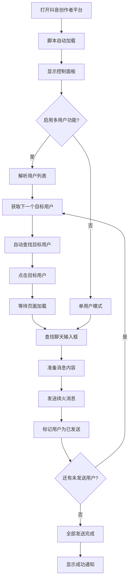

# ScriptCat-Douyin-Fire-Helper 🔥

抖音续火花自动发送助手 - 每天自动发送续火消息，保持好友火花不熄灭！支持多目标用户批量发送，学生党狂喜！

[](https://github.com/dr-190/ScriptCat-Douyin-Fire-Helper/blob/main/LICENSE)
[](https://www.tampermonkey.net/)
[](https://docs.scriptcat.org/)
[](https://github.com/dr-190/ScriptCat-Douyin-Fire-Helper/stargazers)
[](https://github.com/dr-190/ScriptCat-Douyin-Fire-Helper/issues)
[](https://github.com/dr-190/ScriptCat-Douyin-Fire-Helper/releases)

## ✨ 功能特性

### 👥 多目标用户批量发送（新！）
- **批量用户管理**: 支持多个目标用户，用英文逗号、竖线或换行分隔
- **智能发送模式**: 顺序发送或随机发送两种模式可选
- **发送进度跟踪**: 实时显示发送进度（已发送/总用户数）
- **连续自动发送**: 发送完一个用户后自动切换到下一个
- **重试策略配置**: 可选择重试时使用同一用户或切换用户
- **每日重置记录**: 自动重置每日发送记录，避免重复发送

### 🎨 抖音风格界面设计（新！）
- **现代化UI**: 采用抖音风格的深色主题设计，视觉体验更佳
- **功能分类设置**: 设置面板按功能模块分类，查找配置更便捷
- **可拖动面板**: 支持拖拽移动控制面板，自由调整位置
- **重新打开按钮**: 关闭面板后可快速重新打开，操作更流畅

### 🎯 智能目标用户查找
- **自动查找点击**: 配置目标用户名，自动在聊天列表中查找并点击
- **实时状态监控**: 显示用户查找状态（寻找中/已找到/未找到）
- **智能防抖节流**: 优化查找频率，避免页面卡顿
- **多层点击策略**: 支持直接点击和事件触发两种方式

### 🕒 智能定时发送
- **精准定时**: 支持自定义发送时间（默认 00:01:00）
- **自动重试**: 可配置重试机制，最多重试10次
- **每日检测**: 智能判断当日是否已发送，避免重复
- **实时倒计时**: 显示下次发送的精确倒计时

### 🎭 丰富消息内容
- **一言API集成**: 自动获取优美句子，支持自定义格式
- **TXTAPI支持**: 支持外部API和手动文本两种模式
- **灵活格式**: 自定义消息模板，支持占位符替换
- **随机选择**: 手动模式下支持随机或顺序发送文本

### 📊 增强日志系统
- **完整历史记录**: 记录所有操作日志，支持查看和导出
- **智能日志管理**: 自动限制日志数量（默认200条），避免内存占用
- **实时状态显示**: 显示API状态、重试次数等关键信息
- **一键清空**: 支持快速清空所有日志记录

### 🎛️ 人性化控制
- **可视化面板**: 实时显示状态、倒计时和操作日志
- **图形化设置**: 友好的设置界面，配置简单直观
- **状态监控**: 实时显示一言API和TXTAPI状态
- **桌面通知**: 发送成功时显示系统通知

### ⚡ 性能优化
- **智能观察器**: 优化DOM监听机制，减少性能消耗
- **防抖节流**: 控制查找频率，避免页面卡顿
- **内存管理**: 及时清理观察器，防止内存泄漏
- **超时机制**: 所有操作都有超时控制，避免无限等待
- **聊天输入框重试限制**: 新增聊天输入框查找的重试次数限制

## 📸 界面展示

<div align="center">

### 🎛️ 控制面板
<br>
*抖音风格的控制面板，实时显示脚本状态、倒计时和操作日志，新增多用户进度显示*

### ⚙️ 设置界面  
<br>
*功能分类的设置面板，支持多目标用户配置和性能调优，界面风格与抖音保持一致*

### 📊 历史日志
<br>
*完整的历史日志记录，支持查看、导出和清空*

### 👥 多用户发送流程


</div>

## 🛠️ 安装使用

### 前提条件
- 浏览器安装 [ScriptCat（推荐）](https://docs.scriptcat.org/) 或 [Tampermonkey](https://www.tampermonkey.net/) 脚本管理器
- 现代浏览器（Chrome、Edge、Firefox等）

### 快速安装
**已经安装ScriptCat或Tampermonkey的用户点击下方链接快速安装：**

[](https://scriptcat.org/scripts/code/4141/%E6%8A%96%E9%9F%B3%E7%BB%AD%E7%81%AB%E8%8A%B1%E8%87%AA%E5%8A%A8%E5%8F%91%E9%80%81%E5%8A%A9%E6%89%8B-%E9%9B%86%E6%88%90%E4%B8%80%E8%A8%80API%E5%92%8CTXTAPI.user.js)

### 手动安装
1. 下载 [scriptcat-douyin-fire-helper.user.js](https://github.com/dr-190/ScriptCat-Douyin-Fire-Helper/releases/latest/download/scriptcat-douyin-fire-helper.user.js) 文件
2. 在脚本管理器中点击"添加新脚本"
3. 将文件内容粘贴到编辑器中保存
4. 启用脚本

### 使用步骤
1. 打开[抖音创作者平台私信管理页面](https://creator.douyin.com/creator-micro/data/following/chat)
2. 页面右上角会出现控制面板
3. 点击"设置"按钮配置发送时间和消息内容
4. **多用户功能配置**：
   - 在设置中启用"目标用户查找"
   - 在文本框中输入多个用户名，用**英文逗号**、竖线或换行分隔
   - 选择发送模式（顺序发送或随机发送）
   - 配置重试策略
5. 脚本将在指定时间自动查找用户并批量发送续火消息

### ⚠️ 重要设置
**浏览器保持活跃设置（Chrome为例）**：
1. 打开浏览器设置
2. 进入"性能"设置
3. 找到"始终让以下网站保持活跃状态"
4. 添加网站：`creator.douyin.com`
5. 保存设置

## 💻 挂机方案

### 云电脑挂机推荐

为了实现24小时不间断运行，推荐使用**云服务器**或**挂机宝**：

| 平台 | 配置推荐 | 价格参考 | 特点 |
|------|----------|---------|------|
| **阿里云轻量服务器** | 1核1G, 20GB硬盘 | 约24元/月 | 稳定可靠，性能强劲 |
| **腾讯云轻量服务器** | 1核1G, 25GB硬盘 | 约25元/月 | 网络优化，访问快速 |
| **专业挂机宝** | 基础配置 | 约10-20元/月 | 专为挂机优化，价格低廉 |

### 挂机部署步骤

1. **购买云服务器**
   - 选择Windows系统（推荐Windows Server）
   - 基础配置即可满足需求

2. **环境配置**
   - 安装浏览器（推荐[百分浏览器](https://www.centbrowser.cn/)）
   - 安装脚本管理器（Tampermonkey或ScriptCat）
   - 安装本脚本并配置
   - 设置浏览器保持活跃状态

3. **日常维护**
   - 定期检查脚本运行状态
   - 关注更新通知
   - 备份重要配置

## ⚙️ 配置说明

### 👥 多目标用户设置（新！）
- **启用目标用户查找**: 开启自动查找功能
- **目标用户名**: 多个用户名用**英文逗号**、竖线或换行分隔
  - 示例：`用户1,用户2|用户3` 或 
  ```
  用户1
  用户2
  用户3
  ```
- **多用户发送模式**:
  - 顺序发送：按列表顺序发送给每个用户
  - 随机发送：随机选择未发送的用户
- **重试时使用同一用户**: 启用后重试时继续发送给同一用户，否则切换到下一用户

### 🎯 基本用户设置
- **点击方法**: 
  - 直接点击：更可靠，推荐使用
  - 事件触发：更安全，兼容性更好
- **查找超时**: 用户查找的最大等待时间

### ⏰ 基本设置
- **发送时间**: 设置每天的发送时间（格式: HH:mm:ss）
- **重试次数**: 发送失败时的最大重试次数（1-10次）
- **页面加载等待**: 点击用户后等待页面加载的时间

### 🤖 一言API设置
- **启用一言API**: 是否使用一言API
- **消息格式**: 自定义显示格式，支持变量：
  - `{hitokoto}` - 一言内容
  - `{from}` - 出处
  - `{from_who}` - 作者
- **API超时**: 一言API请求超时时间

### 📝 TXTAPI设置
- **启用TXTAPI**: 是否使用TXTAPI功能
- **模式选择**: 
  - API模式: 从指定URL获取文本内容
  - 手动模式: 使用自定义文本列表
- **随机发送**: 手动模式下是否随机选择文本
- **文本内容**: 每行一个文本，支持换行

### ⚡ 性能设置
- **防抖延迟**: 控制查找频率，减少性能消耗
- **节流延迟**: 最小查找间隔，避免频繁操作
- **日志数量**: 最大历史日志数量

### 💬 消息模板
- **自定义格式**: 使用 `[API]` 和 `[TXTAPI]` 作为占位符
- **多行支持**: 支持换行符，创建更丰富的消息格式
- **基础消息**: API获取失败时的备用消息

## 🔧 技术架构

### 🏗️ 系统架构
```
用户界面层
    ↓
业务逻辑层
    ↓
数据访问层
    ↓
抖音网页API
```

### 🔌 API集成
- **一言API**: https://v1.hitokoto.cn/
- **自定义API**: 支持任何返回纯文本的API接口
- **抖音网页API**: 通过DOM操作实现自动化

### 🛡️ 安全特性
- **本地存储**: 所有配置数据存储在本地
- **无数据收集**: 不收集任何用户隐私数据
- **开源透明**: 代码完全开源，可审查

## 📁 项目结构

```
ScriptCat-Douyin-Fire-Helper/
├── scriptcat-douyin-fire-helper.user.js  # 主脚本文件
├── README.md                             # 项目说明文档
├── LICENSE                              # 开源许可证
└── images/                              # 项目图片资源
    ├── screenshot-panel.png             # 控制面板截图
    ├── screenshot-settings.png          # 设置界面截图
    └── screenshot-logs.png              # 日志界面截图
```

# 🚀 更新日志

## 📋 版本概览

### v2.2 (最新版本) - 抖音风格界面与功能优化
🎨 **界面设计升级**
- ✨ **抖音风格设计**: 采用现代化深色主题，界面风格与抖音保持一致
- 🗂️ **功能分类设置**: 设置面板按功能模块分类，查找配置更便捷
- 🖱️ **面板拖动功能**: 支持拖拽移动控制面板，自由调整位置
- 🔄 **重新打开优化**: 优化悬浮按钮的显示效果和交互体验

📏 **显示优化**
- 🖱️ **拖动体验优化**: 改进拖动逻辑，使用left/top定位替代transform

⚡ **稳定性增强**
- 🔄 **聊天输入框重试限制**: 新增聊天输入框查找的重试次数限制，避免无限重试
- 🛡️ **错误处理优化**: 增强各种边界情况的错误处理能力
- 🚀 **性能优化**: 进一步优化DOM操作和事件处理性能

### v2.1 - 多目标用户批量发送系统
👥 **多用户批量发送**
- ✨ **批量用户管理**: 支持多个目标用户，用英文逗号、竖线或换行分隔
- 🔄 **智能发送模式**: 顺序发送和随机发送两种模式
- 📊 **进度跟踪**: 实时显示发送进度（已发送/总用户数）
- 🔁 **连续发送**: 发送完一个用户后自动切换到下一个
- 🎯 **重试策略**: 可配置重试时使用同一用户或切换用户

📈 **增强用户体验**
- 👀 **进度显示**: 控制面板显示发送进度和用户状态
- 🔄 **自动重置**: 每日自动重置发送记录
- 🎛️ **手动重置**: 新增"重置今日发送记录"按钮
- 💾 **状态持久化**: 完善的用户发送状态管理

⚡ **性能优化**
- 🚀 **优化连续发送**: 批量发送时的性能优化
- 🔍 **智能用户切换**: 平滑的用户切换机制
- 🛡️ **错误恢复**: 多用户模式下的错误处理

### v2.0 - 智能目标用户查找系统
🎯 **核心功能升级**
- ✨ **智能目标用户查找**: 自动在聊天列表中查找并点击指定用户
- 🔄 **动态DOM监控**: 实时监控页面变化，适应动态加载内容
- 🎯 **状态管理**: 智能状态切换（寻找中/已找到/未找到）
- 🤖 **全自动流程**: 从查找到发送的完整自动化

📊 **增强日志系统**
- 🗃️ **历史日志面板**: 完整的操作记录查看界面
- 📤 **日志导出功能**: 支持导出为.txt格式文件
- 🔢 **智能日志限制**: 自动管理日志数量（默认200条）
- 🧹 **一键清空**: 快速清理所有历史记录

⚡ **性能优化**
- 🚀 **防抖节流机制**: 大幅降低性能消耗，解决页面卡顿
- 🔍 **优化观察器**: 智能DOM监听，减少内存占用
- ⏱️ **超时控制**: 所有操作都有超时保护
- 🛡️ **内存管理**: 防止内存泄漏的观察器管理

### v1.0 - 核心功能实现
🎉 **基础功能**
- ⏰ **定时发送**: 支持自定义发送时间（HH:mm:ss格式）
- 🤖 **一言API集成**: 自动获取优美句子丰富消息内容
- 📝 **TXTAPI支持**: 支持外部API和手动文本模式
- 💾 **本地存储**: 使用GM_setValue/GM_getValue持久化配置

🖥️ **用户界面**
- 🎛️ **控制面板**: 可视化操作界面，实时状态显示
- ⚙️ **设置界面**: 图形化配置，操作简单直观
- 📊 **操作日志**: 实时显示脚本运行状态
- 🔄 **状态监控**: API状态和重试次数显示

## 🔄 版本对比

| 特性 | v1.0 | v2.0 | v2.1 | v2.2 |
|------|------|------|------|---------|
| 目标用户查找 | ❌ 不支持 | ✅ 单用户 | ✅ 多用户批量 | ✅ 增强版 |
| 用户发送模式 | ❌ 不支持 | ❌ 不支持 | ✅ 顺序/随机 | ✅ 优化版 |
| 发送进度跟踪 | ❌ 不支持 | ❌ 不支持 | ✅ 实时进度 | ✅ 优化版 |
| 连续自动发送 | ❌ 不支持 | ❌ 不支持 | ✅ 批量连续 | ✅ 优化版 |
| 抖音风格界面 | ❌ 基础 | ❌ 基础 | ❌ 基础 | ✅ 现代化 |
| 功能分类设置 | ❌ 单一 | ❌ 单一 | ❌ 单一 | ✅ 分类导航 |
| 面板拖动功能 | ❌ 固定 | ❌ 固定 | ❌ 固定 | ✅ 可拖动 |
| 面板高度优化 | ❌ 基础 | ❌ 基础 | ❌ 基础 | ✅ 1000px |
| 聊天框重试限制 | ❌ 无限制 | ❌ 无限制 | ❌ 无限制 | ✅ 有限制 |
| 历史日志系统 | ❌ 基础日志 | ✅ 完整面板+导出 | ✅ 增强版 | ✅ 优化版 |
| 性能优化 | ❌ 基础 | ✅ 防抖节流+内存管理 | ✅ 批量优化 | ✅ 进一步优化 |
| 状态监控 | ❌ 基础状态 | ✅ 实时状态+颜色标识 | ✅ 多用户状态 | ✅ 优化版 |

## 🎯 升级亮点

### v2.2 界面与交互革命
1. **视觉升级**: 采用抖音风格设计，界面更加现代化和美观
2. **功能分类**: 设置面板按功能模块分类，配置更加清晰便捷
3. **交互优化**: 支持面板拖动，用户可以自由调整位置
4. **用户体验**: 整体操作流程更加流畅自然

### v2.1 重大改进
1. **批量处理**: 从单用户升级到多用户批量发送，大幅提升效率
2. **智能调度**: 支持顺序和随机两种发送模式，满足不同需求
3. **进度可视化**: 实时显示发送进度，清晰掌握发送状态
4. **连续作业**: 自动连续发送，无需人工干预

### v2.0 核心价值
1. **自动化程度**: 从半自动升级到全自动，支持目标用户自动查找点击
2. **性能表现**: 通过防抖节流机制大幅降低资源消耗
3. **用户体验**: 完整的日志系统和实时状态监控
4. **稳定可靠**: 多层错误恢复和内存管理机制

### v1.0 基础功能
1. **基础功能**: 提供稳定的定时发送和消息自定义
2. **API集成**: 一言API和TXTAPI的完整支持
3. **简单易用**: 直观的控制面板和设置界面
4. **稳定运行**: 经过验证的可靠性和兼容性

## 📈 版本规划

### 已实现功能
- ✅ 基础定时发送 (v1.0)
- ✅ 消息内容自定义 (v1.0)  
- ✅ API集成 (v1.0)
- ✅ 目标用户自动查找 (v2.0)
- ✅ 性能优化 (v2.0)
- ✅ 完整日志系统 (v2.0)
- ✅ 多用户批量发送 (v2.1)
- ✅ 抖音风格界面与功能优化 (v2.2)

### 未来规划
- 🔄 更多消息模板

---

**💡 提示**: 建议所有用户升级到 v2.2 版本，享受更好的界面体验和交互优化！

## 🐛 故障排除

### 常见问题

**Q: 用户名分隔符应该使用什么？**
A: 
1. 请使用**英文逗号**（,）作为分隔符，而不是中文逗号（，）
2. 也支持竖线（|）和换行分隔
3. 示例：`用户1,用户2|用户3` 或每行一个用户名

**Q: 控制面板显示不全，日志看不完？**
A: 
1. 升级到v2.2版本或以上版本，面板高度已增加到1000px
2. 可以拖动面板调整位置获得更好视野
3. 查看历史日志面板获取完整日志记录

**Q: 多用户模式下某些用户发送失败怎么办？**
A: 
1. 检查失败的用户名是否完全匹配
2. 查看历史日志了解具体错误信息
3. 使用"重置今日发送记录"后重新发送
4. 调整重试策略配置

**Q: 多用户发送进度不更新？**
A:
1. 检查浏览器控制台是否有错误信息
2. 确认脚本是否有足够权限
3. 尝试重置发送记录重新开始
4. 查看网络连接是否稳定

**Q: 点击用户后无法发送消息？**
A:
1. 增加页面加载等待时间
2. 检查网络连接是否稳定
3. 确认聊天输入框选择器是否正确
4. 尝试切换点击方法

**Q: 页面卡顿或性能问题？**
A:
1. 增加防抖和节流延迟时间
2. 关闭不必要的观察器
3. 减少日志数量限制
4. 重启浏览器释放内存

### 性能优化建议

1. **多用户模式**: 用户数量多时建议使用顺序发送模式
2. **防抖延迟**: 网络环境差时设置为800-1000ms
3. **节流延迟**: 页面卡顿时设置为1500-2000ms  
4. **页面等待**: 网络慢时设置为8000-10000ms
5. **日志数量**: 长期运行时设置为100-150条

## 🤝 贡献指南

我们欢迎各种形式的贡献！

### 报告问题
- 使用 [GitHub Issues](https://github.com/dr-190/ScriptCat-Douyin-Fire-Helper/issues) 报告bug
- 提供详细的错误描述和重现步骤
- 附上相关的日志和截图

### 功能建议
- 在Issues中提出新功能想法
- 描述使用场景和预期效果
- 讨论技术实现的可行性

### 代码贡献
1. Fork本项目
2. 创建功能分支
3. 提交代码更改
4. 发起Pull Request

### 开发环境
- 使用现代浏览器进行测试
- 确保代码兼容Tampermonkey和ScriptCat
- 遵循现有的代码风格

## 📜 开源协议

本项目采用 MIT 协议 - 查看 [LICENSE](LICENSE) 文件了解详情

### 协议要点
- 允许商业使用
- 允许修改和分发
- 允许私人使用
- 无担保责任

## ⚠️ 使用声明

### 重要提醒
- **请合理使用，避免频繁发送消息干扰他人**
- **本脚本仅用于学习交流和技术研究目的**
- **使用前请确保遵守抖音平台的相关规则**
- **开发者不对滥用造成的任何后果负责**

### 合规使用
1. **尊重平台规则，不要用于恶意目的**
2. 控制发送频率，避免被系统检测为异常行为
3. 仅与同意续火的好友使用此功能
4. **如遇平台规则变更，请及时停止使用**

## 🤖 AI 开发声明

**重要声明**: 本脚本由 AI 辅助开发完成，结合了人工测试和优化。

### 开发历程
- **AI辅助开发**: 主要代码逻辑和功能实现由AI生成
- **人工优化**: 经过多次实际测试、调试和性能优化
- **持续改进**: 基于用户反馈不断修复问题和增强功能
- **质量保证**: 每个版本都经过功能测试和兼容性验证

### 技术特点
- 采用现代化的JavaScript ES6+语法
- 模块化架构，便于维护和扩展
- 完善的错误处理和日志系统
- 性能优化的DOM操作和事件处理

## 🌟 致谢

感谢以下项目和服务的支持：

- [一言API](https://hitokoto.cn/) - 提供优美的句子内容
- [Tampermonkey](https://www.tampermonkey.net/) - 强大的用户脚本管理器
- [ScriptCat](https://docs.scriptcat.org/) - 优秀的脚本管理器平台
- [DeepSeek](https://www.deepseek.com/) - 提供AI辅助开发支持
- [所有贡献者](https://github.com/dr-190/ScriptCat-Douyin-Fire-Helper/graphs/contributors) - 感谢每一位贡献者

## 📞 联系我们

- **项目主页**: [GitHub Repository](https://github.com/dr-190/ScriptCat-Douyin-Fire-Helper)
- **问题反馈**: [GitHub Issues](https://github.com/dr-190/ScriptCat-Douyin-Fire-Helper/issues)
- **版本更新**: [Releases](https://github.com/dr-190/ScriptCat-Douyin-Fire-Helper/releases)

---

<div align="center">

**如果这个项目对您有帮助，请给它一个 ⭐ Star！您的支持是我持续更新的动力。**

[](https://star-history.com/#dr-190/ScriptCat-Douyin-Fire-Helper&Date)

</div>
